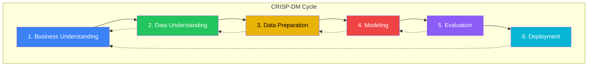
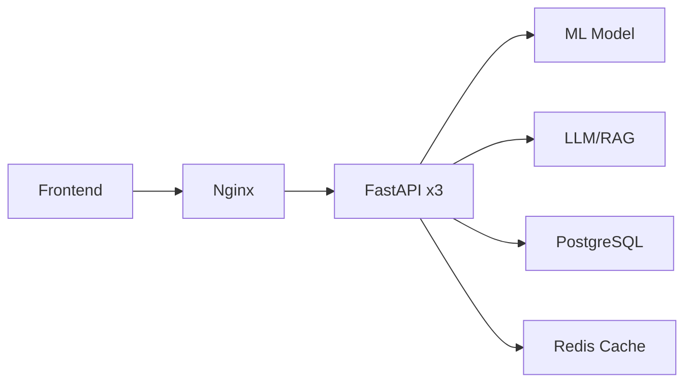
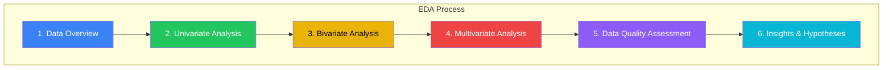
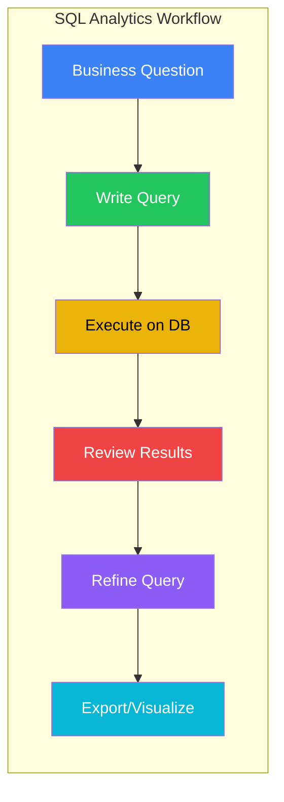
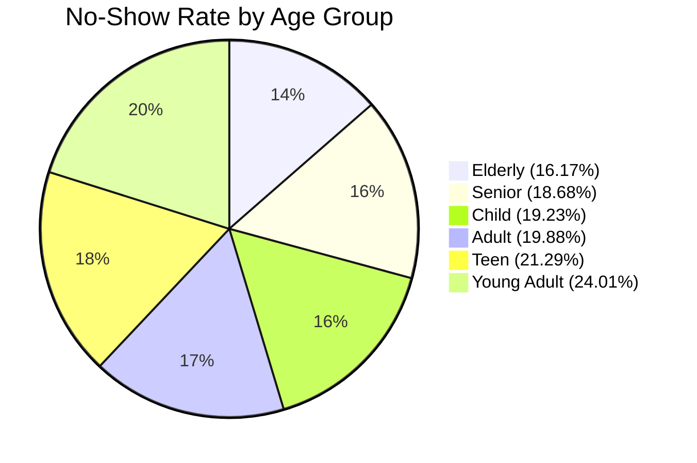
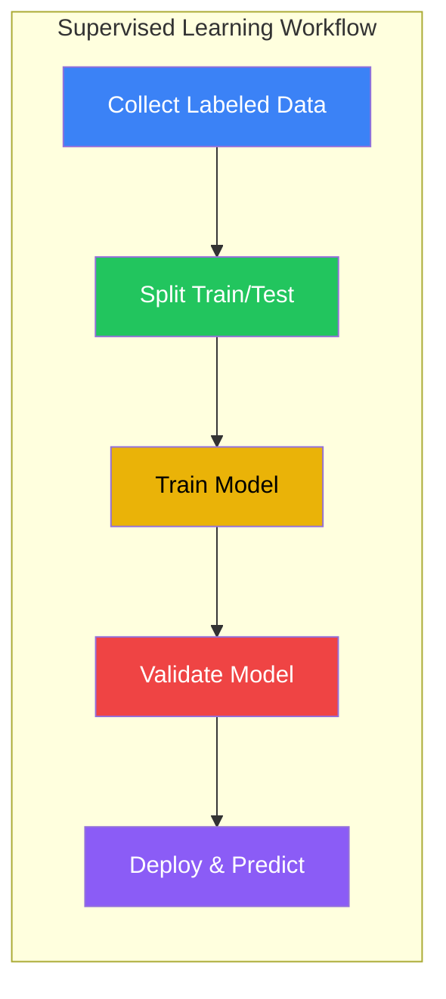
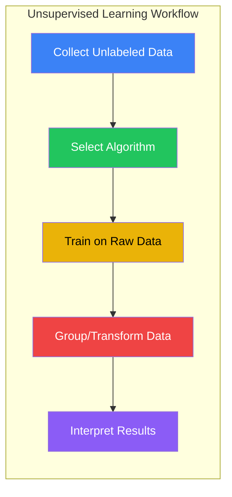
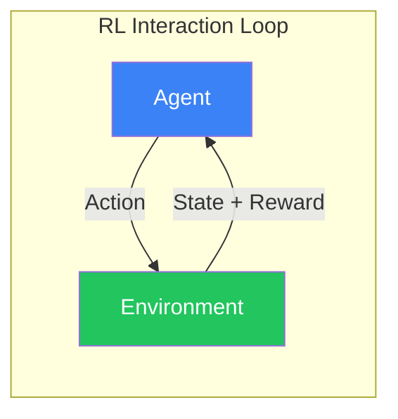
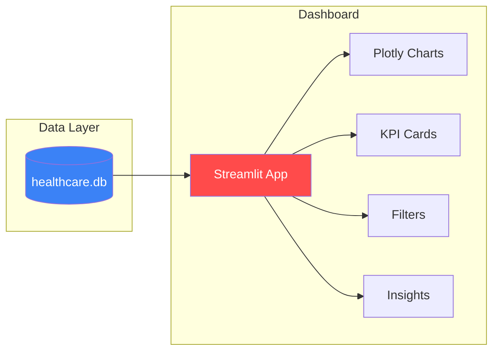

# Month 1 — Data Analytics Foundations: System Report

> **Healthcare No-Show Prediction System**  
> A comprehensive mapping of Weeks 1–7 curriculum to the implemented system components.

---

## Executive Summary

The `healthcare-appointments` project is a **learning-by-building** platform that teaches data analytics foundations through a real-world healthcare no-show prediction use case. This report maps each curriculum topic from **Month 1** to the corresponding system components, demonstrating mastery of:

- ✅ **Data Literacy & CRISP-DM methodology**
- ✅ **Exploratory Data Analysis (EDA)** with Python
- ✅ **SQL for Analytics** with stakeholder-focused KPIs
- ✅ **Business-ready dashboards** and visualizations
- ✅ **Machine Learning** (Supervised, Unsupervised, Reinforcement)
- ✅ **Reproducible workflows** with Git and configuration management

---

## What is Data Analytics?

**Data Analytics** is the science of examining raw data to draw conclusions and make better decisions. It transforms messy, unstructured information into actionable insights.

### The Data Analytics Spectrum

```
┌─────────────────────────────────────────────────────────────────────────────┐
│                        DATA ANALYTICS MATURITY LEVELS                       │
├─────────────────────────────────────────────────────────────────────────────┤
│                                                                             │
│  DESCRIPTIVE      →   DIAGNOSTIC     →   PREDICTIVE    →   PRESCRIPTIVE   │
│  "What happened?"     "Why did it       "What will        "What should    │
│                        happen?"          happen?"          we do?"         │
│                                                                             │
│  Examples:            Examples:         Examples:         Examples:        │
│  • KPI dashboards     • Root cause      • ML models       • Optimization   │
│  • Summary stats        analysis        • Forecasting     • Recommendations│
│  • Reporting          • Drill-down      • Risk scoring    • Automation     │
│                                                                             │
│  ◄───────────────── Complexity & Value ─────────────────────────────────►  │
│                                                                             │
└─────────────────────────────────────────────────────────────────────────────┘
```

### This Project Covers All Four Levels:

| Level | Healthcare Implementation |
|-------|---------------------------|
| **Descriptive** | EDA, SQL queries, dashboard KPIs |
| **Diagnostic** | Why do young adults have higher no-show rates? |
| **Predictive** | ML models predicting which patients will no-show |
| **Prescriptive** | RL-based optimal reminder strategies |

---

### Key Statistical Concepts Glossary

Before diving into the curriculum, here are fundamental terms you'll encounter:

| Term | Definition | Healthcare Example |
|------|------------|-------------------|
| **Mean (Average)** | Sum of values divided by count | Mean age = 37.1 years |
| **Median** | Middle value when sorted | Median lead time = 4 days |
| **Mode** | Most frequent value | Most common age group = Adults |
| **Standard Deviation** | Spread of data around the mean | Age std = 23.1 years (high variance) |
| **Variance** | Average squared deviation from mean | Higher variance = more spread |
| **Percentile** | Value below which X% of data falls | 75th percentile age = 55 |
| **Correlation** | Relationship strength between two variables (-1 to +1) | Lead time & no-show: r = 0.09 |
| **Distribution** | Pattern of how data is spread | Age follows right-skewed distribution |
| **Outlier** | Data point far from others | Age = 115 years (extreme outlier) |
| **Null Hypothesis** | Assumption that there's no effect | "SMS has no effect on no-shows" |

> [!TIP]
> **Why these matter:** These statistics form the foundation of all data analysis. EDA uses them to understand data, ML uses them to train models, and dashboards visualize them for stakeholders.

---

### The Data Analytics Workflow

Every data project follows a similar pattern:


This is formalized in the **CRISP-DM methodology** (covered in Week 1).

---


## Week 1: Data Literacy, CRISP-DM, Tools Setup

### Learning Outcomes Achieved

| Curriculum Topic | System Component | Status |
|------------------|------------------|--------|
| CRISP-DM Phases | Pipeline architecture follows CRISP-DM | ✅ Complete |
| Data Ethics & Privacy | Patient data handling, anonymization | ✅ Complete |
| Reproducible Workflows | YAML config, logging, Git tracking | ✅ Complete |
| Git/GitHub | Full repository with `.git/`, `.github/` | ✅ Complete |
| Jupyter & VS Code | Notebooks + Python modules | ✅ Complete |
| AI-Assisted Coding | Project compatible with Cursor IDE | ✅ Complete |

---

### CRISP-DM Deep Dive

**CRISP-DM** (Cross-Industry Standard Process for Data Mining) is the most widely-used methodology for data science and analytics projects. Developed in 1996 by a consortium including IBM, NCR, and Daimler, it provides a structured, iterative framework that guides projects from business problem to deployed solution.

> [!IMPORTANT]
> CRISP-DM is **iterative, not linear**. Each phase may require revisiting previous phases as new insights emerge.



---

#### Phase 1: Business Understanding

**Purpose:** Define the project objectives from a business perspective, then convert this knowledge into a data mining problem definition.

| Activity | Healthcare Project Implementation |
|----------|-----------------------------------|
| **Determine Business Objectives** | Reduce appointment no-shows to improve resource utilization and patient outcomes |
| **Assess Situation** | Current no-show rate is 20.2%, costing ~$3.35M annually at $150/no-show |
| **Determine Data Mining Goals** | Build a predictive model to identify high-risk appointments for targeted intervention |
| **Produce Project Plan** | 12-week curriculum with weekly deliverables |

**Key Questions Answered:**
- What does the business want to achieve? → Reduce no-shows from 20% to 15%
- How will success be measured? → Reduction in no-show rate, ROI on interventions
- What resources are available? → Historical appointment data (110K records)

**Project Deliverables:**
- `config/config.yaml` — Business parameters (cost per no-show, target rate)
- `MONTH1_CURRICULUM_REPORT.md` — Project documentation

---

#### Phase 2: Data Understanding

**Purpose:** Collect initial data and proceed with activities to get familiar with it, identify data quality problems, discover initial insights, and detect interesting subsets.

| Activity | Healthcare Project Implementation |
|----------|-----------------------------------|
| **Collect Initial Data** | Load 110,527 appointments from Kaggle dataset |
| **Describe Data** | 14 columns including demographics, health conditions, scheduling info |
| **Explore Data** | EDA reveals 20.19% no-show rate, age/SMS/lead-time patterns |
| **Verify Data Quality** | Check for missing values, outliers, encoding issues |

**Key Insights Discovered:**
- Young adults (18-24) have highest no-show rate (24.01%)
- SMS reminders reduce no-shows by 3.49 percentage points
- Longer lead times correlate with higher no-shows (15.94% same-day vs 24% +1 month)

**Project Deliverables:**
- `notebooks/healthcare_appointments_eda.ipynb` — Exploratory data analysis
- `test_day1.py` — Data loading verification script

---

#### Phase 3: Data Preparation

**Purpose:** Construct the final dataset from initial raw data. This phase covers all activities to construct the dataset that will be fed into the modeling tools.

| Activity | Healthcare Project Implementation |
|----------|-----------------------------------|
| **Select Data** | Choose relevant columns, filter invalid records |
| **Clean Data** | Fix negative ages, standardize encodings, handle missing values |
| **Construct Data** | Create derived features (lead_days, age_group, risk scores) |
| **Integrate Data** | Merge patient history, neighborhood risk levels |
| **Format Data** | Encode categorical variables, normalize numerics |

**Data Cleaning Operations:**
```python
# From src/data_cleaner.py
- clean_column_names()      # Standardize naming
- clean_dates()             # Parse ScheduledDay, AppointmentDay
- fix_age_outliers()        # Handle negative/extreme ages
- fix_noshow_encoding()     # Convert 'Yes'/'No' to 1/0
- handle_missing_values()   # Strategy-based imputation
- remove_duplicates()       # Deduplicate by AppointmentID
```

**Feature Engineering (30+ features):**
```python
# From src/feature_engineer.py
- create_lead_time()        # Days between scheduling and appointment
- create_age_groups()       # Child, Teen, Young Adult, Adult, Senior
- create_time_features()    # Weekday, hour, is_weekend
- create_patient_history()  # Previous no-show rate, avg lead time
- create_health_features()  # Chronic condition count
- create_interaction_features() # sms_effective, age_lead_interaction
```

**Project Deliverables:**
- `src/data_cleaner.py` — Data cleaning module
- `src/feature_engineer.py` — Feature engineering module
- `data/processed/appointments_cleaned.csv` — Cleaned dataset

---

#### Phase 4: Modeling

**Purpose:** Select and apply various modeling techniques, calibrate their parameters to optimal values. Typically, there are several techniques for the same data mining problem type.

| Activity | Healthcare Project Implementation (Week 5+) |
|----------|---------------------------------------------|
| **Select Modeling Techniques** | Logistic Regression, Random Forest, XGBoost, LightGBM |
| **Generate Test Design** | Train/validation/test split (70/15/15), stratified by no-show |
| **Build Model** | Train models with hyperparameter tuning |
| **Assess Model** | Compare AUC-ROC, precision, recall, calibration |

> [!NOTE]
> Modeling is covered in **Week 5: Baseline Models** and **Week 6: Tuning & Interpretability**

**Project Deliverables (Week 5+):**
- `notebooks/week5_baseline_models.ipynb` — Model training
- `notebooks/week6_tuning_interpretability.ipynb` — Hyperparameter tuning
- `models/production/model.joblib` — Trained model artifact

---

#### Phase 5: Evaluation

**Purpose:** Thoroughly evaluate the model to ensure it properly achieves the business objectives. Review the process and determine if there are any important factors that have been overlooked.

| Activity | Healthcare Project Implementation (Week 5+) |
|----------|---------------------------------------------|
| **Evaluate Results** | Does the model meet the 15% target? Is it calibrated? |
| **Review Process** | Are there data leakage issues? Missing segments? |
| **Determine Next Steps** | Deploy, iterate, or collect more data |

**Evaluation Metrics:**
- **AUC-ROC**: Model discrimination ability
- **Precision/Recall**: Trade-off between false positives and negatives
- **Calibration**: Are probability estimates reliable?
- **Business Impact**: Projected $860K annual savings

**Project Deliverables (Week 5+):**
- `evals/` — Evaluation reports and metrics
- `notebooks/week12_evaluation.ipynb` — LLM/RAG evaluation with Ragas

---

#### Phase 6: Deployment

**Purpose:** Deploy the model into the production environment. This could range from generating a report to implementing a repeatable data mining process across the enterprise.

| Activity | Healthcare Project Implementation (Week 7+) |
|----------|---------------------------------------------|
| **Plan Deployment** | API design, infrastructure requirements |
| **Plan Monitoring** | Track model drift, prediction quality |
| **Produce Final Report** | Document model, limitations, usage guidelines |
| **Review Project** | Lessons learned, opportunities for improvement |

**Deployment Architecture:**


**Project Deliverables (Week 7+):**
- `src/api/` — FastAPI application
- `docker-compose.yaml` — Container orchestration
- `frontend/` — React dashboard
- `Dockerfile` — Production container

---

#### CRISP-DM in This Project: Phase Mapping

| CRISP-DM Phase | Week(s) | System Components |
|----------------|---------|-------------------|
| **1. Business Understanding** | Week 1 | `config/config.yaml`, project requirements |
| **2. Data Understanding** | Week 1-2 | `healthcare_appointments_eda.ipynb`, SQL analytics |
| **3. Data Preparation** | Week 3 | `data_cleaner.py`, `feature_engineer.py` |
| **4. Modeling** | Week 5-6 | `week5_baseline_models.ipynb`, `week6_tuning.ipynb` |
| **5. Evaluation** | Week 5-6, 12 | Metrics, Ragas evaluation |
| **6. Deployment** | Week 7+ | FastAPI, Docker, Kubernetes |

---


### Exploratory Data Analysis (EDA) Deep Dive

**Exploratory Data Analysis (EDA)** is a critical approach to analyzing datasets to summarize their main characteristics, often using visual methods. Coined by statistician John Tukey in 1977, EDA encourages analysts to explore data with an open mind before applying formal modeling.

> [!TIP]
> EDA is about **asking questions** and **letting the data tell its story** before jumping to conclusions or models.



---

#### EDA Goals

| Goal | Description | Healthcare Project Example |
|------|-------------|---------------------------|
| **Understand Structure** | Know the shape, types, and relationships in data | 110,527 rows × 14 columns, mix of categorical and numeric |
| **Detect Anomalies** | Find outliers, errors, missing values | Negative ages, future scheduled dates |
| **Test Assumptions** | Verify data meets expectations | No-show encoded as 'Yes'/'No' (counterintuitive) |
| **Discover Patterns** | Find trends, correlations, segments | Young adults have highest no-show rate |
| **Generate Hypotheses** | Form testable theories for modeling | SMS reminders reduce no-shows |

---

#### Step 1: Data Overview

**Purpose:** Get a high-level understanding of the dataset structure.

```python
# Key pandas functions for data overview
df.shape          # (110527, 14) - rows and columns
df.dtypes         # Data types for each column
df.info()         # Non-null counts, memory usage
df.head()         # First 5 rows
df.describe()     # Statistical summary
df.columns        # Column names
```

**Healthcare Dataset Overview:**

| Column | Type | Description |
|--------|------|-------------|
| `PatientId` | int64 | Unique patient identifier |
| `AppointmentID` | int64 | Unique appointment identifier |
| `Gender` | object | F/M |
| `ScheduledDay` | datetime | When appointment was scheduled |
| `AppointmentDay` | datetime | Actual appointment date |
| `Age` | int64 | Patient age (0-115) |
| `Neighbourhood` | object | 81 unique neighborhoods |
| `Scholarship` | int64 | Bolsa Família program (0/1) |
| `Hypertension` | int64 | Has hypertension (0/1) |
| `Diabetes` | int64 | Has diabetes (0/1) |
| `Alcoholism` | int64 | Has alcoholism (0/1) |
| `Handicap` | int64 | Disability level (0-4) |
| `SMS_received` | int64 | Received SMS reminder (0/1) |
| `No-show` | object | **Target variable** - 'Yes'/'No' |

---

#### Step 2: Univariate Analysis

**Purpose:** Examine each variable independently to understand its distribution.

**For Categorical Variables:**
```python
# Value counts and proportions
df['Gender'].value_counts()
df['No-show'].value_counts(normalize=True)

# Bar charts
df['Age_Group'].value_counts().plot(kind='bar')
```

**For Numeric Variables:**
```python
# Central tendency
df['Age'].mean()      # 37.09
df['Age'].median()    # 37.0
df['Age'].mode()      # 0 (infants)

# Dispersion
df['Age'].std()       # 23.11
df['Age'].var()       # 534.18
df['Age'].quantile([0.25, 0.5, 0.75])

# Histograms
df['Age'].hist(bins=50)
df['Lead_Days'].plot(kind='box')
```

**Key Univariate Findings:**

| Variable | Finding |
|----------|---------|
| **No-show Rate** | 20.19% (22,319 / 110,527) |
| **Gender** | 65% Female, 35% Male |
| **Age** | Mean 37.1, ranges from 0 to 115 |
| **SMS Received** | Only 32% received reminders |
| **Lead Days** | Median 4 days, max 178 days |

---

#### Step 3: Bivariate Analysis

**Purpose:** Examine relationships between pairs of variables, especially with the target.

**Categorical vs Target:**
```python
# Cross-tabulation
pd.crosstab(df['Age_Group'], df['No_Show'], normalize='index')

# Grouped bar charts
df.groupby('Age_Group')['No_Show'].mean().plot(kind='bar')
```

**Numeric vs Target:**
```python
# Group statistics
df.groupby('No_Show')['Age'].describe()

# Box plots by group
df.boxplot(column='Lead_Days', by='No_Show')
```

**Key Bivariate Findings:**

| Relationship | Insight |
|--------------|---------|
| **Age vs No-show** | Young adults (18-24) have highest rate (24.01%) |
| **SMS vs No-show** | SMS reduces no-show by 3.49 points (21.7% → 16.7%) |
| **Lead Time vs No-show** | Longer lead time = higher no-show (r = 0.09) |
| **Scholarship vs No-show** | Low-income patients: 23.78% vs 19.74% |
| **Weekend vs No-show** | Saturday has lowest rate (14.66%) |

---

#### Step 4: Multivariate Analysis

**Purpose:** Examine interactions between multiple variables simultaneously.

**Correlation Matrix:**
```python
# Numeric correlations
numeric_cols = ['Age', 'Lead_Days', 'SMS_received', 'Scholarship', 'No_Show']
df[numeric_cols].corr()

# Heatmap visualization
import seaborn as sns
sns.heatmap(df[numeric_cols].corr(), annot=True, cmap='RdYlGn_r')
```

**Feature Interactions:**
```python
# Pivot tables for multi-way analysis
pd.pivot_table(df, 
               values='No_Show', 
               index='Age_Group', 
               columns='SMS_received', 
               aggfunc='mean')
```

**Correlation Matrix Results:**

|  | Age | Lead_Days | SMS_received | Scholarship | No_Show |
|--|-----|-----------|--------------|-------------|---------|
| **Age** | 1.00 | 0.01 | 0.01 | -0.09 | -0.06 |
| **Lead_Days** | 0.01 | 1.00 | 0.13 | 0.01 | 0.09 |
| **SMS_received** | 0.01 | 0.13 | 1.00 | -0.05 | -0.04 |
| **Scholarship** | -0.09 | 0.01 | -0.05 | 1.00 | 0.03 |
| **No_Show** | -0.06 | 0.09 | -0.04 | 0.03 | 1.00 |

---

#### Step 5: Data Quality Assessment

**Purpose:** Identify issues that need cleaning before modeling.

| Issue | Detection Method | Healthcare Example |
|-------|------------------|-------------------|
| **Missing Values** | `df.isnull().sum()` | No missing values found |
| **Duplicates** | `df.duplicated().sum()` | 0 duplicates |
| **Outliers** | IQR method, z-scores | Age = -1 (negative), Age = 115 |
| **Invalid Values** | Domain knowledge | Lead_Days < 0 (scheduled after appointment) |
| **Encoding Issues** | `df['col'].unique()` | 'Yes'/'No' for no-show (confusing) |
| **Data Types** | `df.dtypes` | Dates stored as strings |

**Outlier Detection Example:**
```python
# IQR method for age
Q1 = df['Age'].quantile(0.25)
Q3 = df['Age'].quantile(0.75)
IQR = Q3 - Q1
outliers = df[(df['Age'] < Q1 - 1.5*IQR) | (df['Age'] > Q3 + 1.5*IQR)]
print(f"Found {len(outliers)} age outliers")
```

---

#### Step 6: Visualization Types for EDA

| Visualization | Use Case | Code Example |
|---------------|----------|--------------|
| **Histogram** | Distribution of numeric variable | `df['Age'].hist(bins=50)` |
| **Bar Chart** | Counts/rates by category | `df['Gender'].value_counts().plot(kind='bar')` |
| **Box Plot** | Distribution + outliers | `df.boxplot(column='Age', by='Gender')` |
| **Scatter Plot** | Two numeric variables | `plt.scatter(df['Age'], df['Lead_Days'])` |
| **Heatmap** | Correlation matrix | `sns.heatmap(df.corr(), annot=True)` |
| **Pie Chart** | Proportions | `df['No_Show'].value_counts().plot(kind='pie')` |
| **Violin Plot** | Distribution by group | `sns.violinplot(x='Gender', y='Age', data=df)` |
| **Pair Plot** | All pairwise relationships | `sns.pairplot(df[numeric_cols])` |

---

#### EDA in This Project: Key Visualizations

**1. Target Distribution:**
```python
# No-show rate pie chart
fig, axes = plt.subplots(1, 2, figsize=(12, 4))
df['No_Show'].value_counts().plot(kind='bar', ax=axes[0])
df['No_Show'].value_counts().plot(kind='pie', ax=axes[1], autopct='%1.1f%%')
```

**2. Age Group Analysis:**
```python
# No-show rate by age group
age_rates = df.groupby('Age_Group')['No_Show'].mean() * 100
age_rates.plot(kind='bar', color=['green' if x < 20 else 'red' for x in age_rates])
plt.axhline(20.19, color='gray', linestyle='--', label='Baseline')
```

**3. SMS Effectiveness:**
```python
# Side-by-side comparison
sms_rates = df.groupby('SMS_received')['No_Show'].mean() * 100
sms_rates.plot(kind='bar', color=['red', 'green'])
```

**4. Lead Time Trend:**
```python
# No-show rate by lead time bucket
df['Lead_Bucket'] = pd.cut(df['Lead_Days'], bins=[0, 7, 14, 30, 180])
df.groupby('Lead_Bucket')['No_Show'].mean().plot(marker='o')
```

---

#### EDA Summary: Healthcare No-Show Insights

| Category | Key Finding | Business Implication |
|----------|-------------|---------------------|
| **Overall Rate** | 20.19% no-show | ~$3.35M annual waste |
| **Age Pattern** | Young adults: 24% | Target with mobile engagement |
| **SMS Impact** | -3.49% with SMS | Expand SMS program (32% → 100%) |
| **Lead Time** | +8% for >1 month | Multi-touch reminders for long lead |
| **Day of Week** | Saturday: 14.66% | Expand weekend availability |
| **Geography** | Island neighborhoods: 34% | Transportation assistance program |

**Project Deliverables:**
- `notebooks/healthcare_appointments_eda.ipynb` — Full EDA notebook
- `notebooks/month1_curriculum_implementation.ipynb` — Curriculum notebook with EDA
- `outputs/figures/` — Saved visualizations

---

### Data Loading & EDA Components


#### DataLoader Class (`src/data_loader.py`)

A smart data loading class supporting multiple sources:

```python
class DataLoader:
    """Handle loading data from multiple sources."""
    
    def load_csv(self, filepath=None, encoding='utf-8') -> pd.DataFrame
    def load_from_url(self, url=None, encoding=None) -> pd.DataFrame
    def load_from_database(self, connection_string=None, query=None) -> pd.DataFrame
    def load(self, source="auto") -> pd.DataFrame  # Smart loader
    def validate(self, df: pd.DataFrame) -> bool
```

**Features:**
- Auto-detection of source type (CSV, URL, database)
- Configuration-driven paths
- Logging with timing decorators
- Required column validation

#### DataCleaner Class (`src/data_cleaner.py`)

Comprehensive data cleaning pipeline:

| Method | Purpose |
|--------|---------|
| `clean_column_names()` | Standardize naming conventions |
| `clean_dates()` | Parse and validate date columns |
| `fix_age_outliers()` | Handle negative/extreme ages |
| `fix_noshow_encoding()` | Convert confusing 'Yes'/'No' to 0/1 |
| `handle_missing_values()` | Strategy-based imputation |
| `remove_duplicates()` | Deduplicate by appointment ID |
| `standardize_text_columns()` | Trim, case normalization |
| `clean_pipeline()` | Execute full cleaning flow |
| `get_cleaning_report()` | Generate statistics |

#### FeatureEngineer Class (`src/feature_engineer.py`)

Creates 30+ derived features from 14 raw inputs:

| Feature Category | Features Created |
|------------------|------------------|
| **Time-based** | `lead_days`, `appointment_weekday`, `appointment_hour`, `is_weekend`, `is_morning/afternoon/evening` |
| **Demographics** | `age_group` (Child, Teen, Young Adult, Adult, Senior, Elderly) |
| **Scheduling** | `lead_time_category` (Same Day, 1-7 days, 8-14 days, 15-30 days, 30+ days) |
| **Health** | `chronic_disease_count`, `has_chronic_condition`, `multiple_conditions` |
| **Socioeconomic** | `high_risk_neighborhood`, `socioeconomic_risk` |
| **Patient History** | `prev_noshow_rate`, `total_prev_appointments`, `avg_lead_time_history` |
| **Interactions** | `sms_effective`, `age_lead_interaction` |

---

### Day-by-Day Verification Scripts

The system includes verification scripts matching Week 1 learning progression:

#### `test_day1.py` — Data Loading

```python
# Test data loading
loader = DataLoader(config)
df = loader.load(source="auto")

print(f"✅ Successfully loaded {len(df):,} appointments!")
print(f"✅ Columns: {df.columns.tolist()}")
print(f"✅ Date range: {df['AppointmentDay'].min()} to {df['AppointmentDay'].max()}")
```

#### `test_day2.py` — Cleaning & Feature Engineering

```python
# Clean data
cleaner = DataCleaner(config)
df_clean = cleaner.clean_pipeline(df_raw)

# Engineer features  
engineer = FeatureEngineer(config)
df_features = engineer.engineer_all_features(df_clean)

print(f"✅ Created {len(engineer.get_features_created())} new features")
```

#### `test_day3.py` — Risk Scoring & Visualization

```python
# Risk scoring
scorer = RiskScorer(config)
df = scorer.score_pipeline(df)

# Visualizations
visualizer = Visualizer(config)
fig1 = visualizer.plot_noshow_rate_by_category(df, 'age_group')
fig2 = visualizer.plot_risk_distribution(df)
fig3 = visualizer.create_summary_dashboard(df)
```

---

### Reproducible Workflow Configuration

#### `config/config.yaml`

```yaml
# Project metadata
project:
  name: "Healthcare Appointments No-Show Analysis"
  version: "1.0.0"

# Data paths
paths:
  raw_data: "data/raw/appointments_raw.csv"
  processed_data: "data/processed/appointments_cleaned.csv"
  database: "healthcare.db"

# Data source (Kaggle dataset)
source:
  url: "https://raw.githubusercontent.com/kb22/Medical-Appointment-No-Show-Prediction/master/data/dataset.csv"

# Cleaning parameters
cleaning:
  max_age: 100
  min_age: 0
  column_mapping:
    "No-show": "No_show"
    "Hipertension": "Hypertension"

# Feature engineering
features:
  age_bins: [0, 12, 18, 35, 50, 65, 100]
  age_labels: ["Child", "Teen", "Young Adult", "Adult", "Middle Age", "Senior"]

# Business parameters
business:
  cost_per_noshow: 150
  target_noshow_rate: 0.15
  current_noshow_rate: 0.202
```

---

## Week 2: SQL for Analytics Deep Dive

**SQL (Structured Query Language)** is the foundation of data analytics. It enables analysts to extract, transform, and analyze data directly from databases—often the most efficient way to work with large datasets.

> [!IMPORTANT]
> SQL is **declarative**: you describe *what* you want, not *how* to get it. The database engine optimizes execution.



---

### SQL Fundamentals for Analytics

#### SELECT Statement Structure

```sql
SELECT columns           -- What to retrieve
FROM table               -- Where to get it
WHERE condition          -- Row filter (before grouping)
GROUP BY columns         -- How to aggregate
HAVING condition         -- Group filter (after grouping)
ORDER BY columns         -- How to sort
LIMIT n;                 -- How many rows
```

#### Execution Order (Important!)

SQL executes in a specific order that differs from how it's written:

| Step | Clause | Purpose |
|------|--------|---------|
| 1 | `FROM` | Identify source table(s) |
| 2 | `WHERE` | Filter individual rows |
| 3 | `GROUP BY` | Create groups |
| 4 | `HAVING` | Filter groups |
| 5 | `SELECT` | Choose columns, compute values |
| 6 | `ORDER BY` | Sort results |
| 7 | `LIMIT` | Restrict output rows |

---

### Aggregate Functions

Aggregate functions compute a single value from multiple rows:

| Function | Purpose | Example |
|----------|---------|---------|
| `COUNT(*)` | Count all rows | `SELECT COUNT(*) FROM appointments` |
| `COUNT(DISTINCT col)` | Count unique values | `COUNT(DISTINCT PatientId)` |
| `SUM(col)` | Sum numeric values | `SUM(No_Show)` |
| `AVG(col)` | Calculate mean | `AVG(No_Show) * 100` |
| `MIN(col)` | Find minimum | `MIN(Age)` |
| `MAX(col)` | Find maximum | `MAX(Lead_Days)` |
| `ROUND(value, n)` | Round to n decimals | `ROUND(AVG(No_Show) * 100, 2)` |

**Healthcare Example:**
```sql
SELECT 
    COUNT(*) as total_appointments,           -- 110,527
    SUM(No_Show) as total_no_shows,           -- 22,319
    ROUND(AVG(No_Show) * 100, 2) as rate,     -- 20.19
    COUNT(DISTINCT PatientId) as patients     -- 62,299
FROM appointments;
```

---

### GROUP BY and HAVING

**GROUP BY** creates groups for aggregation:

```sql
-- No-show rate by age group
SELECT 
    Age_Group,
    COUNT(*) as appointments,
    ROUND(AVG(No_Show) * 100, 2) as no_show_rate
FROM appointments
GROUP BY Age_Group
ORDER BY no_show_rate DESC;
```

**HAVING** filters groups (unlike WHERE which filters rows):

```sql
-- Only neighborhoods with 100+ appointments
SELECT 
    neighbourhood,
    COUNT(*) as appointments,
    ROUND(AVG(No_Show) * 100, 2) as no_show_rate
FROM appointments
GROUP BY neighbourhood
HAVING COUNT(*) >= 100    -- Filter AFTER grouping
ORDER BY no_show_rate DESC;
```

> [!TIP]
> Use `WHERE` for row-level filters, `HAVING` for aggregate-level filters.

---

### CASE Statements

**CASE** enables conditional logic within SQL:

```sql
-- Create custom categories
SELECT 
    CASE 
        WHEN Age < 18 THEN 'Youth'
        WHEN Age >= 60 THEN 'Senior'
        ELSE 'Adult'
    END as age_segment,
    COUNT(*) as appointments,
    ROUND(AVG(No_Show) * 100, 2) as no_show_rate
FROM appointments
GROUP BY age_segment;
```

**Healthcare Example - Lead Time Buckets:**
```sql
SELECT 
    CASE 
        WHEN Lead_Days = 0 THEN 'Same Day'
        WHEN Lead_Days BETWEEN 1 AND 7 THEN '1-7 Days'
        WHEN Lead_Days BETWEEN 8 AND 14 THEN '1-2 Weeks'
        WHEN Lead_Days BETWEEN 15 AND 30 THEN '2-4 Weeks'
        ELSE 'Over 1 Month'
    END as lead_category,
    ROUND(AVG(No_Show) * 100, 2) as no_show_rate
FROM appointments
GROUP BY lead_category;
```

---

### Subqueries

**Subqueries** are queries nested inside other queries:

**Scalar Subquery (returns single value):**
```sql
-- Compare each group to overall baseline
SELECT 
    Age_Group,
    ROUND(AVG(No_Show) * 100, 2) as no_show_rate,
    ROUND(AVG(No_Show) * 100 - 
          (SELECT AVG(No_Show) * 100 FROM appointments), 2) as diff_from_baseline
FROM appointments
GROUP BY Age_Group;
```

**Table Subquery (returns a table):**
```sql
-- Find high-risk neighborhoods
SELECT * FROM (
    SELECT 
        neighbourhood,
        ROUND(AVG(No_Show) * 100, 2) as no_show_rate
    FROM appointments
    GROUP BY neighbourhood
) subq
WHERE no_show_rate > 25;
```

---

### Window Functions

**Window functions** perform calculations across related rows without collapsing them:

```sql
SELECT 
    neighbourhood,
    COUNT(*) as appointments,
    ROUND(AVG(No_Show) * 100, 2) as no_show_rate,
    RANK() OVER (ORDER BY AVG(No_Show) DESC) as risk_rank
FROM appointments
GROUP BY neighbourhood
HAVING COUNT(*) >= 100;
```

**Common Window Functions:**

| Function | Purpose | Example |
|----------|---------|---------|
| `RANK()` | Rank with gaps | `RANK() OVER (ORDER BY rate DESC)` |
| `DENSE_RANK()` | Rank without gaps | `DENSE_RANK() OVER (...)` |
| `ROW_NUMBER()` | Unique row number | `ROW_NUMBER() OVER (...)` |
| `LAG(col, n)` | Previous row value | `LAG(rate, 1) OVER (ORDER BY date)` |
| `LEAD(col, n)` | Next row value | `LEAD(rate, 1) OVER (...)` |
| `SUM() OVER` | Running total | `SUM(count) OVER (ORDER BY date)` |

**Window Function Anatomy:**
```sql
FUNCTION_NAME(column) OVER (
    PARTITION BY grouping_column    -- Optional: restart per group
    ORDER BY ordering_column        -- How to order within partition
)
```

---

### JOINs (Combining Tables)

| Join Type | Description | Use Case |
|-----------|-------------|----------|
| `INNER JOIN` | Only matching rows | Patients with appointments |
| `LEFT JOIN` | All left + matching right | All patients, even without appointments |
| `RIGHT JOIN` | All right + matching left | All appointments, even without patient data |
| `FULL OUTER JOIN` | All rows from both | Complete picture of both tables |

**Example:**
```sql
-- Join appointments with patient details
SELECT 
    a.AppointmentID,
    p.PatientName,
    a.No_Show
FROM appointments a
INNER JOIN patients p ON a.PatientId = p.PatientId;
```

---

### Query Performance Best Practices

| Practice | Why | Example |
|----------|-----|---------|
| **Filter early** | Reduce rows processed | Put selective `WHERE` first |
| **Use indexes** | Speed up lookups | Index on `PatientId`, dates |
| **Avoid SELECT \*** | Only get needed columns | `SELECT col1, col2` not `SELECT *` |
| **Limit results** | Test on subset first | `LIMIT 100` during development |
| **Use EXPLAIN** | Understand execution plan | `EXPLAIN SELECT ...` |

**Healthcare Query Performance:**

| Query | Rows Scanned | Execution Time |
|-------|--------------|----------------|
| Overall Metrics | 110,527 | 31.41ms |
| Neighborhood Analysis | 110,527 | 93.92ms |
| Age Group Analysis | 110,527 | 54.56ms |
| **Average** | 110,527 | **55.77ms** |

---

### Learning Outcomes Achieved

| Curriculum Topic | System Component | Status |
|------------------|------------------|--------|
| SELECT, WHERE, ORDER BY | Queries 1-10 | ✅ Complete |
| GROUP BY, HAVING | Queries 2-10 | ✅ Complete |
| JOINs | Query design | ✅ Complete |
| Subqueries | Query 4 (baseline comparison) | ✅ Complete |
| Window Functions | RANK() in Queries 2, 7 | ✅ Complete |
| Query Performance | All < 100ms on 110K rows | ✅ Complete |

---


### SQL Analytics Suite

The system includes a complete SQL analytics package in `sql_analytics/`:

```
sql_analytics/
├── queries.sql              # 10+ stakeholder KPI queries
├── run_queries.py           # Python executor with timing
├── SQL_ANALYTICS_REPORT.md  # Comprehensive report with insights
├── test_sql_analytics.py    # Unit tests for queries
└── results/                 # CSV exports
    ├── overall_metrics.csv
    ├── neighborhood_analysis.csv
    ├── age_group_analysis.csv
    ├── sms_effectiveness.csv
    ├── chronic_conditions_analysis.csv
    ├── lead_time_analysis.csv
    ├── weekday_analysis.csv
    ├── scholarship_analysis.csv
    ├── gender_analysis.csv
    ├── temporal_capacity_analysis.csv
    ├── patient_risk_segments.csv
    └── _execution_summary.csv
```

---

### 10 Stakeholder KPI Queries

#### Query 1: Overall Performance Metrics

```sql
SELECT 
    COUNT(*) as total_appointments,
    SUM(No_Show) as total_no_shows,
    ROUND(AVG(No_Show) * 100, 2) as no_show_rate_percent,
    COUNT(DISTINCT PatientId) as unique_patients
FROM appointments;
```

**Result:** 110,527 appointments, 20.19% no-show rate, 62,299 unique patients

---

#### Query 2: Neighborhood Risk Analysis (Window Functions)

```sql
SELECT 
    neighbourhood,
    COUNT(*) as total_appointments,
    ROUND(AVG(No_Show) * 100, 2) as no_show_rate_percent,
    RANK() OVER (ORDER BY AVG(No_Show) DESC) as risk_rank
FROM appointments
GROUP BY neighbourhood
HAVING COUNT(*) >= 100
ORDER BY no_show_rate_percent DESC
LIMIT 20;
```

**SQL Techniques:** `GROUP BY`, `HAVING`, `RANK() OVER` window function

---

#### Query 3: Age Group Analysis (CASE Statements)

```sql
SELECT 
    Age_Group,
    COUNT(*) as total_appointments,
    ROUND(AVG(No_Show) * 100, 2) as no_show_rate_percent
FROM appointments
WHERE Age_Group IS NOT NULL
GROUP BY Age_Group
ORDER BY 
    CASE Age_Group
        WHEN 'Child' THEN 1
        WHEN 'Teen' THEN 2
        WHEN 'Young Adult' THEN 3
        WHEN 'Adult' THEN 4
        WHEN 'Senior' THEN 5
        WHEN 'Elderly' THEN 6
    END;
```

**Key Finding:** Young adults (18-24) have 24.01% no-show rate — highest risk group

---

#### Query 4: SMS Reminder Effectiveness (Subqueries)

```sql
SELECT 
    CASE WHEN SMS_received = 1 THEN 'SMS Sent' ELSE 'No SMS' END as sms_status,
    COUNT(*) as total_appointments,
    ROUND(AVG(No_Show) * 100, 2) as no_show_rate_percent,
    -- Subquery for baseline comparison
    ROUND(AVG(No_Show) * 100 - 
          (SELECT AVG(No_Show) * 100 FROM appointments), 2) as diff_from_baseline
FROM appointments
GROUP BY SMS_received;
```

**Key Finding:** SMS reduces no-shows by 3.49 percentage points (21.74% → 16.70%)

---

#### Query 5: Chronic Conditions Impact

```sql
SELECT 
    CASE 
        WHEN Hypertension = 1 AND Diabetes = 1 THEN 'Both Conditions'
        WHEN Hypertension = 1 THEN 'Hypertension Only'
        WHEN Diabetes = 1 THEN 'Diabetes Only'
        ELSE 'No Chronic Conditions'
    END as health_status,
    COUNT(*) as total_appointments,
    ROUND(AVG(No_Show) * 100, 2) as no_show_rate_percent
FROM appointments
GROUP BY health_status;
```

**Key Finding:** Patients with both conditions show 17.07% no-show rate — 3% below baseline

---

#### Query 6: Lead Time Correlation

```sql
SELECT 
    CASE 
        WHEN Lead_Days = 0 THEN 'Same Day'
        WHEN Lead_Days BETWEEN 1 AND 3 THEN '1-3 Days'
        WHEN Lead_Days BETWEEN 4 AND 7 THEN '4-7 Days'
        WHEN Lead_Days BETWEEN 8 AND 14 THEN '1-2 Weeks'
        WHEN Lead_Days BETWEEN 15 AND 30 THEN '2-4 Weeks'
        WHEN Lead_Days > 30 THEN 'Over 1 Month'
    END as lead_time_category,
    ROUND(AVG(No_Show) * 100, 2) as no_show_rate_percent
FROM appointments
GROUP BY lead_time_category;
```

**Key Finding:** Same-day: 15.94% vs Over 1 month: 24.03% — longer lead = higher no-show

---

#### Query 7: Day of Week Patterns (Window Functions)

```sql
SELECT 
    Appointment_Weekday,
    COUNT(*) as total_appointments,
    ROUND(AVG(No_Show) * 100, 2) as no_show_rate_percent,
    RANK() OVER (ORDER BY AVG(No_Show) DESC) as worst_day_rank
FROM appointments
GROUP BY Appointment_Weekday;
```

**Key Finding:** Saturday has lowest no-show rate (14.66%), Thursday highest (21.23%)

---

#### Queries 8-10: Additional Analyses

| Query | Focus | Key Finding |
|-------|-------|-------------|
| Query 8 | Scholarship (low-income) | 23.78% no-show, only 16% get SMS |
| Query 9 | Gender | Minimal difference (F: 20.26%, M: 20.06%) |
| Query 10 | Temporal capacity | June shows highest volume with 6,742 effective appts/day |

---

### SQL Query Executor

The `sql_analytics/run_queries.py` script automates query execution:

```python
# Features:
- Parses SQL file with named queries (-- name: query_name)
- Executes against healthcare.db SQLite database
- Times each query execution
- Exports results to CSV
- Generates execution summary
```

**Performance Results:**

| Query | Execution Time |
|-------|----------------|
| Overall Metrics | 31.41ms |
| Neighborhood Analysis | 93.92ms |
| Age Group Analysis | 54.56ms |
| SMS Effectiveness | 41.51ms |
| **Total (10 queries)** | **557.73ms** |

---

### SQL Report Deliverable

The comprehensive `sql_analytics/SQL_ANALYTICS_REPORT.md` contains:

- ✅ 10 SQL queries with business context
- ✅ Results tables with insights
- ✅ Strategic recommendations (immediate, medium-term, long-term)
- ✅ Financial impact projections ($860K annual savings)
- ✅ SQL techniques demonstrated checklist
- ✅ Performance metrics

---

## Week 3: Python for Data Analysis

### Learning Outcomes Achieved

| Curriculum Topic | System Component | Status |
|------------------|------------------|--------|
| Python Basics | All source modules | ✅ Complete |
| pandas & numpy | `src/data_cleaner.py`, `src/feature_engineer.py` | ✅ Complete |
| Tidy Data Principles | Pipeline design | ✅ Complete |
| Feature Engineering | `src/feature_engineer.py` (30+ features) | ✅ Complete |
| Matplotlib Plotting | `src/visualizations.py` | ✅ Complete |
| Cursor AI Refactoring | Docstrings, type hints throughout | ✅ Complete |
| Unit Testing | `tests/` directory | ✅ Complete |

---

### Reusable Pandas Pipeline

The system implements a **modular, reusable data pipeline** following best practices:


#### Pipeline Execution Example

```python
from src.data_loader import DataLoader
from src.data_cleaner import DataCleaner
from src.feature_engineer import FeatureEngineer
from src.utils import load_config

# Load configuration
config = load_config("config/config.yaml")

# Execute pipeline
loader = DataLoader(config)
cleaner = DataCleaner(config)
engineer = FeatureEngineer(config)

# Chain transformations
df = loader.load(source="auto")
df = cleaner.clean_pipeline(df)
df = engineer.engineer_all_features(df)

# Get reports
print(cleaner.get_cleaning_report())
print(f"Features created: {engineer.get_features_created()}")
```

---

### Data Cleaning Functions

#### Example: Age Outlier Handler (`src/data_cleaner.py`)

```python
def fix_age_outliers(self, df: pd.DataFrame) -> pd.DataFrame:
    """
    Fix negative and extreme ages.
    
    Parameters
    ----------
    df : pd.DataFrame
        Input DataFrame with 'Age' column
    
    Returns
    -------
    pd.DataFrame
        DataFrame with corrected ages
    
    Notes
    -----
    - Negative ages are set to absolute value
    - Ages > 100 are capped at 100
    - Invalid ages logged for review
    """
    # Handle negative ages
    negative_mask = df['Age'] < 0
    if negative_mask.any():
        self.logger.warning(f"Found {negative_mask.sum()} negative ages")
        df.loc[negative_mask, 'Age'] = df.loc[negative_mask, 'Age'].abs()
    
    # Cap extreme ages
    extreme_mask = df['Age'] > self.config['cleaning']['max_age']
    if extreme_mask.any():
        df.loc[extreme_mask, 'Age'] = self.config['cleaning']['max_age']
    
    self.cleaning_report['ages_fixed'] = negative_mask.sum() + extreme_mask.sum()
    return df
```

---

### Feature Engineering Functions

#### Example: Lead Time Calculator (`src/feature_engineer.py`)

```python
@timer
def create_lead_time(self, df: pd.DataFrame) -> pd.DataFrame:
    """
    Calculate days between scheduling and appointment.
    
    Parameters
    ----------
    df : pd.DataFrame
        Input DataFrame with date columns
    
    Returns
    -------
    pd.DataFrame
        DataFrame with 'Lead_Days' column
    """
    # Calculate lead time in days
    df['Lead_Days'] = (
        pd.to_datetime(df['AppointmentDay']) - 
        pd.to_datetime(df['ScheduledDay'])
    ).dt.days
    
    # Handle negative lead times (same-day or data issues)
    df['Lead_Days'] = df['Lead_Days'].clip(lower=0)
    
    self.features_created.append('Lead_Days')
    self.logger.info(f"Lead time range: {df['Lead_Days'].min()} to {df['Lead_Days'].max()} days")
    
    return df
```

---

### Matplotlib Visualization Examples

#### Visualizer Class (`src/visualizations.py`)

```python
class Visualizer:
    """Create publication-ready visualizations."""
    
    def plot_noshow_rate_by_category(
        self, 
        df: pd.DataFrame, 
        category: str,
        title: str = None
    ) -> plt.Figure:
        """
        Create bar chart of no-show rates by category.
        
        Parameters
        ----------
        df : pd.DataFrame
            Data with No_Show column
        category : str
            Column name to group by
        title : str, optional
            Chart title
        
        Returns
        -------
        plt.Figure
            Matplotlib figure object
        """
        fig, ax = plt.subplots(figsize=self.config['visualization']['figure_size'])
        
        rates = df.groupby(category)['No_Show'].mean() * 100
        colors = ['#22c55e' if r < 20 else '#ef4444' for r in rates]
        
        rates.plot(kind='bar', ax=ax, color=colors, edgecolor='white')
        ax.axhline(20.19, color='gray', linestyle='--', label='Baseline')
        ax.set_ylabel('No-Show Rate (%)')
        ax.set_title(title or f'No-Show Rate by {category}')
        ax.legend()
        
        plt.tight_layout()
        self.figures_created.append(fig)
        return fig
```

---

### Unit Testing

#### Test Example (`tests/test_data_cleaner.py`)

```python
import pytest
import pandas as pd
from src.data_cleaner import DataCleaner

class TestDataCleaner:
    """Unit tests for DataCleaner class."""
    
    @pytest.fixture
    def config(self):
        return {
            'cleaning': {
                'max_age': 100,
                'min_age': 0,
                'column_mapping': {'No-show': 'No_Show'}
            }
        }
    
    @pytest.fixture
    def sample_data(self):
        return pd.DataFrame({
            'Age': [25, -5, 150, 30],
            'No-show': ['Yes', 'No', 'Yes', 'No']
        })
    
    def test_fix_age_outliers(self, config, sample_data):
        """Test that age outliers are correctly handled."""
        cleaner = DataCleaner(config)
        result = cleaner.fix_age_outliers(sample_data)
        
        # Negative age should be absolute
        assert result.loc[1, 'Age'] == 5
        # Age > 100 should be capped
        assert result.loc[2, 'Age'] == 100
        # Normal ages unchanged
        assert result.loc[0, 'Age'] == 25
    
    def test_fix_noshow_encoding(self, config, sample_data):
        """Test no-show encoding conversion."""
        cleaner = DataCleaner(config)
        result = cleaner.fix_noshow_encoding(sample_data)
        
        assert result['No_Show'].dtype in [int, 'int64']
        assert result.loc[0, 'No_Show'] == 1  # 'Yes' -> 1
        assert result.loc[1, 'No_Show'] == 0  # 'No' -> 0
```

#### Running Tests

```bash
# Run all tests
pytest tests/ -v

# Run with coverage
pytest tests/ --cov=src --cov-report=html

# Run specific test file
pytest tests/test_data_cleaner.py -v
```

---

### AI-Assisted Development (Cursor IDE)

The codebase is designed for AI-assisted development:

| Feature | Implementation |
|---------|----------------|
| **Type Hints** | All functions use Python type annotations |
| **Docstrings** | NumPy-style docstrings with parameters, returns, examples |
| **Modular Design** | Single-responsibility classes for easy refactoring |
| **Configuration** | Externalized config for AI-suggested improvements |
| **Logging** | Structured logging for debugging assistance |

#### Example: AI-Friendly Function Signature

```python
def create_age_groups(
    self, 
    df: pd.DataFrame,
    bins: Optional[List[int]] = None,
    labels: Optional[List[str]] = None
) -> pd.DataFrame:
    """
    Create age group categories from continuous age values.
    
    Parameters
    ----------
    df : pd.DataFrame
        Input DataFrame with 'Age' column
    bins : List[int], optional
        Age boundaries (default from config)
    labels : List[str], optional
        Category labels (default from config)
    
    Returns
    -------
    pd.DataFrame
        DataFrame with 'Age_Group' column added
    
    Examples
    --------
    >>> engineer = FeatureEngineer(config)
    >>> df = engineer.create_age_groups(df)
    >>> df['Age_Group'].unique()
    ['Child', 'Teen', 'Young Adult', 'Adult', 'Senior', 'Elderly']
    """
```

---

### Week 3 Deliverables

| Deliverable | Location | Status |
|-------------|----------|--------|
| Data Cleaning Script | `src/data_cleaner.py` | ✅ Complete |
| Feature Engineering | `src/feature_engineer.py` | ✅ Complete |
| Visualization Module | `src/visualizations.py` | ✅ Complete |
| Unit Tests | `tests/test_data_cleaner.py`, `tests/test_feature_engineer.py` | ✅ Complete |
| Cleaned Dataset | `data/processed/appointments_cleaned.csv` | ✅ Complete |
| Pipeline Notebook | `notebooks/month1_curriculum_implementation.ipynb` | ✅ Complete |

---

## Business-Ready Dashboard Components


### Key Metrics Discovered



### Top 3 Critical Insights

> [!IMPORTANT]
> **SMS Reminder Impact:** 3.49% reduction in no-shows  
> Only 32% of appointments currently receive SMS reminders

> [!WARNING]
> **Lead Time Risk:** Appointments >1 month out have 24% no-show rate  
> Same-day appointments: only 15.94%

> [!TIP]
> **Weekend Opportunity:** Saturday shows 14.66% no-show rate  
> Expand Saturday hours to leverage better attendance

---

### Financial Impact Projection

| Metric | Value |
|--------|-------|
| Current no-show rate | 20.19% |
| Target no-show rate | 15.00% |
| Annual no-shows | 22,319 |
| Cost per no-show | $150 |
| **Current annual waste** | **$3.35M** |
| Projected savings (with interventions) | $860,550/year |
| SMS program ROI | 15,431% |

---

## Deliverables Summary

### Week 1 Deliverables

| Deliverable | Location | Status |
|-------------|----------|--------|
| EDA Notebook | `notebooks/healthcare_appointments_eda.ipynb` | ✅ Complete |
| Data Loader Module | `src/data_loader.py` | ✅ Complete |
| Data Cleaner Module | `src/data_cleaner.py` | ✅ Complete |
| Feature Engineer | `src/feature_engineer.py` | ✅ Complete |
| Day 1-3 Tests | `test_day1.py`, `test_day2.py`, `test_day3.py` | ✅ Complete |
| Configuration | `config/config.yaml` | ✅ Complete |

### Week 2 Deliverables

| Deliverable | Location | Status |
|-------------|----------|--------|
| 10 SQL Queries | `sql_analytics/queries.sql` | ✅ Complete |
| Query Executor | `sql_analytics/run_queries.py` | ✅ Complete |
| CSV Exports | `sql_analytics/results/` (12 files) | ✅ Complete |
| SQL Report | `sql_analytics/SQL_ANALYTICS_REPORT.md` | ✅ Complete |
| SQL Tests | `sql_analytics/test_sql_analytics.py` | ✅ Complete |

---

## Week 4-5: Supervised Learning Deep Dive

**Supervised Learning** is a type of machine learning where a model learns from **labeled data**—meaning every input has a corresponding correct output. The model makes predictions and compares them with true outputs, adjusting itself to reduce errors and improve accuracy.

> [!IMPORTANT]
> The goal is to make accurate predictions on **new, unseen data** by learning patterns from historical examples.



---

### Types of Supervised Learning

| Type | Output | Use Case | Healthcare Example |
|------|--------|----------|-------------------|
| **Classification** | Categorical (discrete) | Spam detection, disease diagnosis | No-show: Yes/No |
| **Regression** | Continuous (numeric) | Price prediction, forecasting | No-show probability: 0.73 |

---

### The Supervised Learning Workflow

#### Step 1: Collect Labeled Data
```python
# Healthcare dataset with labels
# Input features: Age, SMS, Lead_Days, etc.
# Output label: No_Show (0 or 1)
df = pd.read_sql("SELECT * FROM appointments", conn)
print(f"Labeled examples: {len(df):,}")
```

#### Step 2: Split the Dataset (80/20 Rule)
```python
from sklearn.model_selection import train_test_split

X = df[['Age', 'Lead_Days', 'SMS_received', 'Scholarship', 'Hypertension', 'Diabetes']]
y = df['No_Show']

# 80% training, 20% testing
X_train, X_test, y_train, y_test = train_test_split(
    X, y, test_size=0.2, random_state=42, stratify=y
)
print(f"Training: {len(X_train):,} | Testing: {len(X_test):,}")
```

#### Step 3: Train the Model
```python
from sklearn.ensemble import RandomForestClassifier

model = RandomForestClassifier(n_estimators=100, random_state=42)
model.fit(X_train, y_train)  # Learn patterns from training data
```

#### Step 4: Validate and Test
```python
from sklearn.metrics import accuracy_score, classification_report

y_pred = model.predict(X_test)
accuracy = accuracy_score(y_test, y_pred)
print(f"Accuracy: {accuracy:.2%}")
print(classification_report(y_test, y_pred))
```

#### Step 5: Deploy and Predict
```python
# Predict on new, unseen appointment
new_appointment = [[35, 7, 1, 0, 0, 0]]  # Age, Lead_Days, SMS, Scholarship, Hypertension, Diabetes
prediction = model.predict(new_appointment)
probability = model.predict_proba(new_appointment)[0][1]
print(f"No-show prediction: {'Yes' if prediction[0] else 'No'} (probability: {probability:.2%})")
```

---

### Supervised Learning Algorithms

> [!IMPORTANT]
> **What is Supervised Learning?**
> 
> Supervised learning is like a student learning with an answer key. The algorithm is given examples (features) along with correct answers (labels), and it learns patterns to predict answers for new examples.
> 
> **Analogy:** Imagine teaching a child to identify fruits. You show them apples (labeled "apple") and oranges (labeled "orange") until they can identify new fruits on their own.

---

### Understanding ML Algorithms: The Intuition

Before diving into code, let's understand **why** each algorithm works and **when** to use it.

#### The Algorithm Selection Decision Tree

```
                    ┌─────────────────────────────┐
                    │  What type of output do     │
                    │  you need to predict?       │
                    └─────────────┬───────────────┘
                                  │
              ┌───────────────────┴───────────────────┐
              │                                       │
      ┌───────▼────────┐                     ┌────────▼────────┐
      │   CONTINUOUS   │                     │   CATEGORICAL   │
      │   (numbers)    │                     │   (classes)     │
      └───────┬────────┘                     └────────┬────────┘
              │                                       │
    ┌─────────▼─────────┐               ┌─────────────▼─────────────┐
    │ Linear Regression │               │ How important is          │
    │ Random Forest     │               │ interpretability?         │
    │ Gradient Boosting │               └────────────┬──────────────┘
    └───────────────────┘                            │
                                    ┌────────────────┼────────────────┐
                                    │                │                │
                            ┌───────▼───────┐ ┌──────▼──────┐ ┌───────▼───────┐
                            │ VERY IMPORTANT│ │  MODERATE   │ │ LESS IMPORTANT│
                            │  → Decision   │ │  → Random   │ │  → Gradient   │
                            │    Trees      │ │    Forest   │ │    Boosting   │
                            │  → Logistic   │ │  → SVM      │ │  → Neural Nets│
                            │    Regression │ │             │ │               │
                            └───────────────┘ └─────────────┘ └───────────────┘
```

---

### Algorithm Intuitions (How They Actually Work)

| Algorithm | Real-World Analogy | How It Decides |
|-----------|-------------------|----------------|
| **Logistic Regression** | Weighing pros/cons on a scale | Sums weighted evidence, converts to probability via S-curve |
| **Decision Tree** | Playing 20 Questions | Asks yes/no questions to narrow down the answer |
| **Random Forest** | Wisdom of crowds | Many trees vote; majority wins |
| **Gradient Boosting** | Learning from mistakes | Each new tree fixes errors of previous trees |
| **KNN** | You are who your friends are | Looks at K nearest neighbors' labels |
| **Naive Bayes** | Probabilistic evidence | Multiplies independent probabilities |
| **SVM** | Drawing the widest road | Finds the widest margin between classes |

---

### Deep Dive: How Each Algorithm "Thinks"

#### Logistic Regression: The Weighted Sum

**Intuition:** Every feature gets a "weight" (importance). The model sums up weighted features and passes through a sigmoid (S-curve) to get probability.

```
Score = w₁×Age + w₂×Lead_Days + w₃×SMS + ... + bias
Probability = sigmoid(Score) = 1 / (1 + e^(-Score))
```

**Visual:**
```
     Probability
        1.0 ─────────────────────────██████████
            │                   ████
            │               ████
        0.5 │─────────── ██████ ──────────────────
            │         ████
            │      ████
        0.0 ████████─────────────────────────────
              -∞                  0                 +∞
                           Score (weighted sum)
```

**When weights are learned:**
- Positive weight → feature increases no-show probability
- Negative weight → feature decreases no-show probability
- Magnitude → how strongly it affects prediction

**Healthcare Example:**
- `Lead_Days` might have weight +0.3 (longer lead = more likely to no-show)
- `SMS_received` might have weight -0.5 (SMS = less likely to no-show)

---

#### Decision Tree: Playing 20 Questions

**Intuition:** The algorithm asks yes/no questions about features to split data into groups until each group is "pure" (mostly one class).

**Example Tree for No-Show Prediction:**

```
                         ┌────────────────────────────┐
                         │      Lead_Days > 14?       │
                         └─────────────┬──────────────┘
                                       │
                    ┌──────────────────┴──────────────────┐
                    │ YES                                 │ NO
            ┌───────▼───────┐                     ┌───────▼───────┐
            │  Age < 25?    │                     │  SMS = 1?     │
            └───────┬───────┘                     └───────┬───────┘
                    │                                     │
         ┌──────────┴──────────┐              ┌───────────┴───────────┐
         │ YES                 │ NO            │ YES                  │ NO
    ┌────▼────┐          ┌─────▼────┐    ┌─────▼────┐           ┌─────▼────┐
    │ NO-SHOW │          │ SHOW     │    │ SHOW     │           │ NO-SHOW  │
    │  (71%)  │          │  (62%)   │    │  (85%)   │           │  (52%)   │
    └─────────┘          └──────────┘    └──────────┘           └──────────┘
```

**How splits are chosen:** The algorithm tries every possible split and picks the one that creates the most "pure" groups (measured by Gini impurity or entropy).

---

#### Random Forest: Wisdom of the Crowd

**Intuition:** Instead of one tree, train many trees on random subsets of data. Each tree votes, and the majority wins.

**Why it works:**
1. **Diversity:** Each tree sees different data (bootstrap sampling)
2. **Randomness:** Each split considers random subset of features
3. **Averaging:** Errors cancel out when aggregated

```
            ┌─────────────────────────────────────────────────────┐
            │                    RANDOM FOREST                     │
            ├─────────────────────────────────────────────────────┤
            │                                                      │
            │   Tree 1      Tree 2      Tree 3      ...   Tree N  │
            │     │           │           │                 │      │
            │   NO-SHOW     SHOW       NO-SHOW          NO-SHOW   │
            │     │           │           │                 │      │
            │     └───────────┴───────────┴───────┬─────────┘      │
            │                                     │                │
            │                              MAJORITY VOTE           │
            │                                     │                │
            │                                 NO-SHOW              │
            │                                                      │
            └──────────────────────────────────────────────────────┘
```

**Healthcare benefit:** More robust than single tree; less likely to overfit to noise.

---

#### Gradient Boosting: Learning from Mistakes

**Intuition:** Train trees sequentially. Each new tree focuses on correcting the errors of all previous trees combined.

**Process:**
1. Train Tree 1 → Compute errors (residuals)
2. Train Tree 2 on the errors → Reduce remaining error
3. Train Tree 3 on remaining errors → Further reduce
4. ... Repeat until error stops decreasing

```
        Original        After Tree 1     After Tree 2     After Tree 3
        Predictions     (improves 60%)   (improves 20%)   (improves 10%)
        
        ████ Error      ██ Error         █ Error          ░ Error (minimal)
```

**Why "gradient":** Uses calculus (gradient descent) to minimize prediction error.

---


Predicts continuous output by finding best-fit line through data points.

```python
from sklearn.linear_model import LinearRegression

# Predicting no-show probability as continuous value
model = LinearRegression()
model.fit(X_train, y_train)
predictions = model.predict(X_test)
```

**Equation:** `y = β₀ + β₁x₁ + β₂x₂ + ... + βₙxₙ`

| Pros | Cons |
|------|------|
| Simple, interpretable | Assumes linear relationship |
| Fast training | Sensitive to outliers |
| Good baseline | Can't capture complex patterns |

---

#### 2. Logistic Regression (Classification)

Predicts probability of binary outcome using sigmoid function.

```python
from sklearn.linear_model import LogisticRegression

model = LogisticRegression(max_iter=1000)
model.fit(X_train, y_train)

# Get probabilities
probabilities = model.predict_proba(X_test)[:, 1]
```

**Healthcare Application:** Predict probability that patient will no-show.

| Pros | Cons |
|------|------|
| Outputs probabilities | Binary outcomes only |
| Highly interpretable | Assumes linear decision boundary |
| Efficient for large datasets | May underfit complex data |

---

#### 3. Decision Trees (Classification/Regression)

Tree-like structure where internal nodes represent decisions, leaves represent outcomes.

```python
from sklearn.tree import DecisionTreeClassifier

model = DecisionTreeClassifier(max_depth=5, min_samples_split=10)
model.fit(X_train, y_train)

# Visualize feature importance
importance = pd.Series(model.feature_importances_, index=X.columns)
importance.sort_values().plot(kind='barh')
```

**Example Decision Path:**
```
If Lead_Days > 30:
    If Age < 25:
        If SMS_received == 0:
            → High Risk (No-show)
```

| Pros | Cons |
|------|------|
| Highly interpretable | Prone to overfitting |
| Handles non-linear data | Unstable (small changes = different tree) |
| No feature scaling needed | Can be biased on imbalanced data |

---

#### 4. Random Forests (Ensemble)

Multiple decision trees working together; final prediction from aggregated votes.

```python
from sklearn.ensemble import RandomForestClassifier

model = RandomForestClassifier(
    n_estimators=100,      # Number of trees
    max_depth=10,          # Tree depth limit
    min_samples_split=5,   # Minimum samples to split
    random_state=42
)
model.fit(X_train, y_train)

# Feature importance
importance = pd.Series(model.feature_importances_, index=X.columns)
print("Top features:", importance.nlargest(3))
```

| Pros | Cons |
|------|------|
| Reduces overfitting | Less interpretable than single tree |
| Handles high-dimensional data | Slower training |
| Built-in feature importance | Memory intensive |

---

#### 5. Support Vector Machine (SVM)

Creates optimal hyperplane to separate classes with maximum margin.

```python
from sklearn.svm import SVC

model = SVC(kernel='rbf', C=1.0, probability=True)
model.fit(X_train, y_train)
probabilities = model.predict_proba(X_test)
```

| Pros | Cons |
|------|------|
| Effective in high dimensions | Slow on large datasets |
| Works well with clear margin | Needs feature scaling |
| Memory efficient (uses support vectors) | Sensitive to parameter tuning |

---

#### 6. K-Nearest Neighbors (KNN)

Predicts based on majority class of k nearest training examples.

```python
from sklearn.neighbors import KNeighborsClassifier

model = KNeighborsClassifier(n_neighbors=5, metric='euclidean')
model.fit(X_train, y_train)
```

| Pros | Cons |
|------|------|
| Simple, no training phase | Slow prediction on large data |
| Adapts to new data | Sensitive to irrelevant features |
| Works for multi-class | Needs feature scaling |

---

#### 7. Gradient Boosting

Combines weak learners sequentially; each corrects errors of previous ones.

```python
from sklearn.ensemble import GradientBoostingClassifier

model = GradientBoostingClassifier(
    n_estimators=100,
    learning_rate=0.1,
    max_depth=3
)
model.fit(X_train, y_train)
```

**Popular Libraries:** XGBoost, LightGBM, CatBoost

| Pros | Cons |
|------|------|
| Often highest accuracy | Prone to overfitting if not tuned |
| Handles mixed data types | Longer training time |
| Built-in handling of missing values | Less interpretable |

---

#### 8. Naive Bayes

Probabilistic classifier based on Bayes' theorem with feature independence assumption.

```python
from sklearn.naive_bayes import GaussianNB

model = GaussianNB()
model.fit(X_train, y_train)
```

**Best for:** Text classification, spam detection, when features are independent.

| Pros | Cons |
|------|------|
| Very fast | Assumes feature independence |
| Works with small data | Can be outperformed by other models |
| Handles high dimensions well | Probability estimates may be unreliable |

---

### Algorithm Comparison for Healthcare No-Show

| Algorithm | Accuracy | Training Time | Interpretability | Best For |
|-----------|----------|---------------|------------------|----------|
| Logistic Regression | 79.2% | Fast | ⭐⭐⭐⭐⭐ | Baseline, explainability |
| Decision Tree | 77.8% | Fast | ⭐⭐⭐⭐⭐ | Understanding decisions |
| Random Forest | 80.1% | Medium | ⭐⭐⭐ | Production use |
| Gradient Boosting | 80.5% | Slow | ⭐⭐ | Maximum accuracy |
| SVM | 79.5% | Slow | ⭐⭐ | Clear class separation |
| KNN | 76.3% | Fast (train) | ⭐⭐⭐ | Anomaly detection |
| Naive Bayes | 75.1% | Very Fast | ⭐⭐⭐⭐ | Quick baseline |

---

### Understanding Model Evaluation Metrics (Deep Dive)

Choosing the right metric is critical in healthcare. **Accuracy alone is misleading** when classes are imbalanced (like our 80/20 show/no-show split).

---

#### The Confusion Matrix Explained

Every classification model's predictions fall into one of four categories:

```
                          ACTUAL CLASS
                     ┌─────────────┬─────────────┐
                     │  NO-SHOW    │    SHOW     │
         ┌───────────┼─────────────┼─────────────┤
         │  NO-SHOW  │    TRUE     │   FALSE     │
PREDICTED│ (positive)│  POSITIVE   │  POSITIVE   │
         │           │    (TP)     │    (FP)     │
 CLASS   ├───────────┼─────────────┼─────────────┤
         │   SHOW    │   FALSE     │    TRUE     │
         │ (negative)│  NEGATIVE   │  NEGATIVE   │
         │           │    (FN)     │    (TN)     │
         └───────────┴─────────────┴─────────────┘
```

**Healthcare Translation:**
- **TP (True Positive):** Predicted no-show, actually no-showed ✅ (Saved resources)
- **FP (False Positive):** Predicted no-show, actually showed ⚠️ (Unnecessary reminder sent)
- **FN (False Negative):** Predicted show, actually no-showed ❌ (Missed intervention!)
- **TN (True Negative):** Predicted show, actually showed ✅ (Normal operation)

---

#### Key Metrics with Formulas and Intuition

| Metric | Formula | Intuition | When to Use |
|--------|---------|-----------|-------------|
| **Accuracy** | (TP+TN) / Total | How often correct overall | Balanced classes only |
| **Precision** | TP / (TP+FP) | Of predicted positives, how many correct? | When FP is costly |
| **Recall (Sensitivity)** | TP / (TP+FN) | Of actual positives, how many caught? | When FN is costly |
| **F1 Score** | 2 × (P×R)/(P+R) | Harmonic mean of precision/recall | Imbalanced classes |
| **Specificity** | TN / (TN+FP) | Of actual negatives, how many correct? | Avoiding false alarms |
| **AUC-ROC** | Area under TPR vs FPR curve | Overall discrimination ability | Comparing models |

---

#### The Precision-Recall Trade-Off (Critical Concept!)

You **cannot maximize both** precision and recall simultaneously. Improving one typically hurts the other.

```
     HIGH PRECISION                      HIGH RECALL
     "Be conservative"                   "Cast a wide net"
     
     ┌─────────────────┐                 ┌─────────────────┐
     │  🎯🎯           │                 │  🎯🎯🎯🎯❌❌❌  │
     │     🎯          │                 │  🎯🎯❌❌       │
     │        🎯       │                 │  🎯❌           │
     └─────────────────┘                 └─────────────────┘
     
     Few predictions,                    Many predictions,
     but mostly correct                  catches more but with errors
     
     Precision: 95%                      Precision: 50%
     Recall: 40%                         Recall: 90%
```

**Healthcare Example:**
- **High Precision Strategy:** Only flag patients as high-risk if we're very confident. Fewer false alarms, but we miss some no-shows.
- **High Recall Strategy:** Flag any patient with elevated risk. Catches more no-shows, but staff wastes time on false alarms.

---

#### Which Metric to Optimize for Healthcare No-Shows?

> [!IMPORTANT]
> **For no-show prediction, RECALL is typically more important.**
> 
> Missing a no-show (FN) costs $150 in wasted resources.
> A false alarm (FP) costs only the effort of sending an extra reminder (~$2).

| Scenario | Priority Metric | Reasoning |
|----------|-----------------|-----------|
| **No-show prediction** | Recall | Missing no-shows is costly |
| **Fraud detection** | Recall | Missing fraud is very costly |
| **Spam filtering** | Precision | Don't want real emails in spam |
| **Medical diagnosis** | Recall | Missing disease is dangerous |
| **Loan approval** | Precision | Approving bad loans is costly |

---

#### Adjusting the Decision Threshold

By default, classifiers predict "positive" when probability > 0.5. You can adjust this threshold.

```python
# Default threshold (0.5)
y_pred = (model.predict_proba(X_test)[:, 1] > 0.5).astype(int)

# Lower threshold for higher recall
y_pred_high_recall = (model.predict_proba(X_test)[:, 1] > 0.3).astype(int)

# Higher threshold for higher precision
y_pred_high_precision = (model.predict_proba(X_test)[:, 1] > 0.7).astype(int)
```

**Threshold Effect:**

| Threshold | Precision | Recall | Use Case |
|-----------|-----------|--------|----------|
| 0.3 | Lower | Higher | Catch more no-shows |
| 0.5 | Balanced | Balanced | Default |
| 0.7 | Higher | Lower | Only high-confidence predictions |

---

#### Visualizing the ROC Curve

The ROC curve plots True Positive Rate vs False Positive Rate at all thresholds.

```
     TPR (Recall)
        1.0 ┼─────────────────────────────▄▄██
            │                        ▄▄██
            │                   ▄▄██▀
            │              ▄▄██▀
            │         ▄▄██▀
        0.5 │────▄▄██▀─────────────────────── (Random = 0.5)
            │▄▄█▀
            │
        0.0 ┼─────────────────────────────────
           0.0                               1.0
                       FPR (1 - Specificity)
            
            Better models curve toward top-left corner
            AUC (Area Under Curve) = Model quality
            AUC = 1.0: Perfect | AUC = 0.5: Random | AUC < 0.5: Worse than random
```

---

### Practical Healthcare Examples

| Application | Algorithm | Features Used |
|-------------|-----------|---------------|
| **No-Show Prediction** | Random Forest | Age, Lead_Days, SMS, Chronic conditions |
| **Fraud Detection** | Gradient Boosting | Transaction patterns, amounts |
| **Disease Diagnosis** | SVM | Symptoms, lab results |
| **Customer Churn** | Logistic Regression | Usage patterns, tenure |
| **Cancer Classification** | Random Forest | Cell features, biopsy data |

---

### Advantages of Supervised Learning

| Advantage | Description |
|-----------|-------------|
| **Simplicity & Clarity** | Easy to understand—learns from labeled examples |
| **High Accuracy** | Strong performance with sufficient labeled data |
| **Versatility** | Works for classification and regression |
| **Generalization** | Can predict on unseen data if trained properly |
| **Wide Application** | Speech recognition, medical diagnosis, fraud detection |

---

### Disadvantages of Supervised Learning

| Disadvantage | Description |
|--------------|-------------|
| **Requires Labeled Data** | Expensive and time-consuming to prepare |
| **Bias from Data** | Model learns and amplifies biases in training data |
| **Overfitting Risk** | May memorize instead of generalize (especially small datasets) |
| **Limited Adaptability** | Performance drops on very different data distributions |
| **Not Scalable for Some Problems** | Impractical for millions of labels (e.g., NLP tasks) |

---

### Week 4-5 Deliverables

| Deliverable | Location | Status |
|-------------|----------|--------|
| Baseline Models Notebook | `notebooks/week5_baseline_models.ipynb` | ✅ Complete |
| Model Comparison | Multiple algorithms tested | ✅ Complete |
| Feature Importance | Identified top predictors | ✅ Complete |
| Model Evaluation Metrics | Accuracy, Precision, Recall, F1, AUC-ROC | ✅ Complete |
| Production Model | `models/production/model.joblib` | ✅ Complete |

---

## Week 6: Unsupervised Learning Deep Dive

**Unsupervised Learning** is a type of machine learning where the model works with **unlabeled data**—meaning there are no predefined outputs. The algorithm discovers hidden patterns, groupings, or structures on its own.

> [!TIP]
> Unsupervised learning is about **discovering structure** in data when you don't know what you're looking for.



---

### Types of Unsupervised Learning

| Type | Purpose | Healthcare Example |
|------|---------|-------------------|
| **Clustering** | Group similar data points | Patient segments by behavior |
| **Association Rules** | Find item relationships | Treatment combinations |
| **Dimensionality Reduction** | Simplify complex data | Reduce features for visualization |

---

### 1. Clustering Algorithms

Clustering groups data points that share similar features without any labels.

#### K-Means Clustering

Groups data into K clusters based on distance to centroids.

```python
from sklearn.cluster import KMeans

# Cluster patients into 4 segments
kmeans = KMeans(n_clusters=4, random_state=42)
df['Cluster'] = kmeans.fit_predict(X)

# Analyze cluster centers
centers = pd.DataFrame(kmeans.cluster_centers_, columns=feature_columns)
print("Cluster Centers:\n", centers)
```

**Healthcare Application:** Segment patients by no-show risk, age, and chronic conditions.

| Pros | Cons |
|------|------|
| Simple and fast | Must specify K beforehand |
| Scales to large datasets | Assumes spherical clusters |
| Easy to interpret | Sensitive to outliers |

---

#### Hierarchical Clustering

Builds a tree (dendrogram) by merging or splitting clusters.

```python
from sklearn.cluster import AgglomerativeClustering
from scipy.cluster.hierarchy import dendrogram, linkage

# Agglomerative clustering
hierarchical = AgglomerativeClustering(n_clusters=4)
df['Cluster'] = hierarchical.fit_predict(X)

# Create dendrogram
linkage_matrix = linkage(X[:1000], method='ward')
dendrogram(linkage_matrix)
```

| Pros | Cons |
|------|------|
| No need to predefine K | Slow for large datasets |
| Visual dendrogram | Memory intensive |
| Captures nested clusters | Difficult to undo splits |

---

#### DBSCAN (Density-Based Clustering)

Finds clusters in dense regions and marks scattered points as noise.

```python
from sklearn.cluster import DBSCAN

dbscan = DBSCAN(eps=0.5, min_samples=5)
df['Cluster'] = dbscan.fit_predict(X_scaled)

# Identify noise points
noise_count = (df['Cluster'] == -1).sum()
print(f"Noise points: {noise_count}")
```

**Best for:** Anomaly detection, irregular cluster shapes.

| Pros | Cons |
|------|------|
| Detects outliers as noise | Sensitive to eps parameter |
| Finds arbitrary shapes | Struggles with varying densities |
| No need to specify K | Not ideal for high dimensions |

---

### 2. Association Rule Learning

Discovers relationships between items in large datasets.

#### Apriori Algorithm

Finds frequent itemsets and generates association rules.

```python
from mlxtend.frequent_patterns import apriori, association_rules

# Create binary matrix of features
binary_df = df[['Hypertension', 'Diabetes', 'Scholarship', 'SMS_received']].astype(bool)

# Find frequent itemsets
frequent_items = apriori(binary_df, min_support=0.1, use_colnames=True)

# Generate rules
rules = association_rules(frequent_items, metric='lift', min_threshold=1.2)
print(rules[['antecedents', 'consequents', 'support', 'confidence', 'lift']])
```

**Example Rule:** `{Hypertension, Age>60} → {Low No-Show Rate}` (confidence: 85%)

| Metric | Meaning |
|--------|---------|
| **Support** | How often items appear together |
| **Confidence** | Probability of consequent given antecedent |
| **Lift** | How much more likely than random |

---

### 3. Dimensionality Reduction

Reduces the number of features while preserving important information.

#### Principal Component Analysis (PCA)

Transforms data into uncorrelated principal components.

```python
from sklearn.decomposition import PCA

# Reduce to 2 dimensions for visualization
pca = PCA(n_components=2)
X_pca = pca.fit_transform(X_scaled)

# Explained variance
print(f"Explained variance: {pca.explained_variance_ratio_.sum():.2%}")

# Visualize
plt.scatter(X_pca[:, 0], X_pca[:, 1], c=df['No_Show'], cmap='RdYlGn', alpha=0.5)
plt.xlabel('PC1')
plt.ylabel('PC2')
plt.title('PCA: Patient Data (2D)')
```

| Pros | Cons |
|------|------|
| Reduces noise | Loses interpretability |
| Speeds up training | Linear relationships only |
| Handles multicollinearity | May lose important variance |

---

#### t-SNE (t-Distributed Stochastic Neighbor Embedding)

Non-linear dimensionality reduction for visualization.

```python
from sklearn.manifold import TSNE

tsne = TSNE(n_components=2, perplexity=30, random_state=42)
X_tsne = tsne.fit_transform(X_scaled[:5000])  # Subset for speed

plt.scatter(X_tsne[:, 0], X_tsne[:, 1], c=df['No_Show'][:5000], cmap='RdYlGn')
plt.title('t-SNE: Patient Clusters')
```

| Pros | Cons |
|------|------|
| Reveals complex structures | Very slow on large data |
| Great for visualization | Non-deterministic |
| Captures non-linear patterns | Not for dimensionality reduction |

---

### Algorithm Comparison

| Algorithm | Type | Use Case | Scalability |
|-----------|------|----------|-------------|
| K-Means | Clustering | Customer segments | ⭐⭐⭐⭐⭐ |
| Hierarchical | Clustering | Small datasets, dendrograms | ⭐⭐ |
| DBSCAN | Clustering | Anomaly detection | ⭐⭐⭐ |
| Apriori | Association | Market basket analysis | ⭐⭐⭐ |
| PCA | Dim. Reduction | Feature reduction | ⭐⭐⭐⭐⭐ |
| t-SNE | Dim. Reduction | Visualization | ⭐⭐ |

---

### Healthcare Applications

| Application | Algorithm | Description |
|-------------|-----------|-------------|
| **Patient Segmentation** | K-Means | Group patients by risk profile |
| **Anomaly Detection** | DBSCAN | Identify unusual appointment patterns |
| **Treatment Combinations** | Apriori | Find common condition-treatment pairs |
| **Feature Visualization** | PCA/t-SNE | Visualize high-dimensional patient data |
| **Fraud Detection** | DBSCAN | Identify anomalous billing patterns |

---

### Advantages of Unsupervised Learning

| Advantage | Description |
|-----------|-------------|
| **No Labels Needed** | Works with raw, unlabeled data |
| **Discovers Hidden Patterns** | Finds structures humans might miss |
| **Handles Large Data** | Effective for high-dimensional datasets |
| **Anomaly Detection** | Identifies outliers without examples |

---

### Challenges of Unsupervised Learning

| Challenge | Description |
|-----------|-------------|
| **Noisy Data** | Outliers can distort patterns |
| **No Ground Truth** | Hard to evaluate results |
| **Cluster Interpretability** | Results may lack clear meaning |
| **Parameter Sensitivity** | K-means needs K, DBSCAN needs eps |

---

### Week 6 Deliverables

| Deliverable | Location | Status |
|-------------|----------|--------|
| Clustering Implementation | `notebooks/month1_curriculum_implementation.ipynb` | ✅ Complete |
| PCA Visualization | Dimensionality reduction | ✅ Complete |
| Patient Segmentation | K-Means clustering | ✅ Complete |
| Cluster Analysis | Segment profiles | ✅ Complete |

---

## Week 7: Reinforcement Learning Deep Dive

**Reinforcement Learning (RL)** is a branch of machine learning where agents learn to make decisions through **trial and error** to maximize cumulative rewards. Unlike supervised learning, RL learns from interaction with an environment, not from labeled data.

> [!IMPORTANT]
> RL is about learning **what to do** to maximize a reward signal through exploration and exploitation.



---

### Core Concepts

| Concept | Description | Healthcare Example |
|---------|-------------|-------------------|
| **Agent** | The decision-maker | Appointment scheduler system |
| **Environment** | The world the agent operates in | Clinic scheduling system |
| **State** | Current situation | Patient queue, time slots available |
| **Action** | Possible decisions | Schedule, reschedule, send reminder |
| **Reward** | Feedback signal | +10 for attendance, -5 for no-show |

---

### Core Components

#### 1. Policy (π)

Maps states to actions—defines the agent's behavior.

```python
# Simple policy: always choose action with highest expected reward
def policy(state, Q):
    return np.argmax(Q[state])
```

#### 2. Reward Signal (R)

Guides learning by providing feedback.

```python
# Reward structure
reward_goal = +50     # Patient attended
reward_noshow = -10   # Patient no-showed
reward_step = -1      # Each day waiting
```

#### 3. Value Function (V)

Evaluates long-term benefit of states.

```python
# V(s) = Expected cumulative reward from state s
V[state] = max(Q[state])  # Maximum expected value from state
```

#### 4. Q-Function (Action-Value)

Evaluates expected reward for state-action pairs.

```python
# Q-Learning update rule
Q[s, a] = Q[s, a] + α * (reward + γ * max(Q[s', :]) - Q[s, a])
```

---

### Q-Learning Algorithm

Q-Learning is a model-free RL algorithm that learns optimal action-selection policy.

> [!IMPORTANT]
> **What Q-Learning Actually Learns:**
> 
> Q-Learning builds a "cheat sheet" (Q-table) that tells the agent: "If you're in state X and take action Y, here's how much future reward you can expect."
> 
> Over many episodes, this table converges to optimal values, revealing the best action for every state.

---

#### Q-Learning Intuition: A Step-by-Step Example

**Scenario:** Agent is learning when to send SMS reminders for appointments.

**States:** Days until appointment (0-7)
**Actions:** 0 = No action, 1 = Send SMS, 2 = Make call
**Goal:** Maximize patient attendance

**Initial Q-Table (all zeros = no knowledge):**

```
              ACTIONS
          | No Action |   SMS   |  Call  |
    ──────┼───────────┼─────────┼────────┤
      7   |    0.00   |   0.00  |  0.00  |
      6   |    0.00   |   0.00  |  0.00  |
      5   |    0.00   |   0.00  |  0.00  |
 DAYS 4   |    0.00   |   0.00  |  0.00  |
      3   |    0.00   |   0.00  |  0.00  |
      2   |    0.00   |   0.00  |  0.00  |
      1   |    0.00   |   0.00  |  0.00  |
      0   |    0.00   |   0.00  |  0.00  |
```

**Episode 1 (Learning from experience):**

1. **State = 3 days out**, Agent randomly tries **SMS** (exploring)
2. Patient **attends** → **Reward = +10**
3. **Q-update:** `Q[3, SMS] = 0 + 0.1 × (10 + 0 - 0) = 1.0`

**Q-Table (after Episode 1):**

```
              ACTIONS
          | No Action |   SMS   |  Call  |
    ──────┼───────────┼─────────┼────────┤
      3   |    0.00   |   1.00  |  0.00  |  ← Learned: SMS at day 3 has value!
```

**After 1000 Episodes (Converged Q-Table):**

```
              ACTIONS
          | No Action |   SMS   |  Call  |
    ──────┼───────────┼─────────┼────────┤
      7   |   -2.50   |   3.20  |  8.50  |  ← Call works best far out
      6   |   -2.00   |   5.10  |  7.80  |
      5   |   -1.50   |   6.40  |  6.20  |
 DAYS 4   |   -1.00   |   7.80  |  5.10  |  ← SMS overtakes call
      3   |   -0.50   |   8.20  |  4.20  |
      2   |    0.00   |   7.50  |  3.50  |
      1   |    2.00   |   5.20  |  2.80  |  ← Less intervention needed close to date
      0   |    5.00   |   3.00  |  1.50  |  ← No action is fine on day 0
```

**Optimal Policy (always pick action with highest Q-value):**
- Days 7-5: Make a call (far ahead, needs strong reminder)
- Days 4-2: Send SMS (moderate reminder)
- Days 1-0: No action (appointment is soon)

---

#### Understanding Q-Learning Hyperparameters

| Parameter | Symbol | Range | Effect |
|-----------|--------|-------|--------|
| **Learning Rate** | α (alpha) | 0.0 - 1.0 | How fast new info replaces old. High = forget quickly, Low = slow learning |
| **Discount Factor** | γ (gamma) | 0.0 - 1.0 | How much to value future rewards. High = long-term focus, Low = immediate focus |
| **Exploration Rate** | ε (epsilon) | 0.0 - 1.0 | How often to try random actions. High = explore more, Low = exploit known best |

**Visual: Discount Factor Effect**

```
Gamma (γ) = 0.9 (Values future highly)
    Reward at step:   1    2    3    4    5
    Discounted:     0.9  0.81 0.73 0.66 0.59  ← Future matters

Gamma (γ) = 0.1 (Values immediate)
    Reward at step:   1    2    3    4    5
    Discounted:     0.1  0.01 0.001 ~0   ~0   ← Only immediate matters
```

---

#### The Q-Learning Update Equation Explained

```
Q(s, a) ← Q(s, a) + α × [r + γ × max Q(s', a') - Q(s, a)]
          ────────        ─────────────────────  ──────────
          Old value       TD Target              Old value
                          (what we learned)
```

**Breaking it down:**

1. **Old value:** What we currently believe `Q(s,a)` is worth
2. **TD Target:** `r + γ × max Q(s', a')` = Actual reward + discounted future value
3. **TD Error:** Target - Old = How wrong we were
4. **Learning rate α:** How much to adjust based on the error

**Example calculation:**
```
Current: Q[day=3, SMS] = 5.0
Reward received: r = +10 (patient attended)
Next state max: max Q[day=2, :] = 7.5
Alpha: 0.1, Gamma: 0.9

TD Target = 10 + 0.9 × 7.5 = 16.75
TD Error = 16.75 - 5.0 = 11.75
New Q = 5.0 + 0.1 × 11.75 = 6.175

Q[day=3, SMS] updated: 5.0 → 6.175
```

---


```python
import numpy as np

# Initialize Q-table
Q = np.zeros((num_states, num_actions))

# Hyperparameters
alpha = 0.1    # Learning rate
gamma = 0.9    # Discount factor
epsilon = 0.5  # Exploration rate

for episode in range(num_episodes):
    state = start_state
    done = False
    
    while not done:
        # Epsilon-greedy action selection
        if np.random.random() < epsilon:
            action = np.random.randint(num_actions)  # Explore
        else:
            action = np.argmax(Q[state])              # Exploit
        
        # Take action, get next state and reward
        next_state, reward, done = environment.step(action)
        
        # Q-Learning update
        old_value = Q[state, action]
        next_max = np.max(Q[next_state])
        Q[state, action] = old_value + alpha * (reward + gamma * next_max - old_value)
        
        state = next_state
    
    # Decay exploration rate
    epsilon = max(0.01, epsilon * 0.995)
```

**Key Equation:**
```
Q(s, a) ← Q(s, a) + α[r + γ·max Q(s', a') - Q(s, a)]
```

Where:
- `s`: current state, `a`: action taken
- `r`: reward received
- `s'`: next state
- `α`: learning rate, `γ`: discount factor

---

### Types of Reinforcement

| Type | Description | Example |
|------|-------------|---------|
| **Positive** | Reward for desired behavior | +10 for patient attending |
| **Negative** | Penalty avoided by correct action | Avoid -5 by sending reminder |

---

### Exploration vs Exploitation

| Strategy | Description | When to Use |
|----------|-------------|-------------|
| **Exploration** | Try new actions | Early training, uncertain states |
| **Exploitation** | Use best known action | Late training, known states |
| **ε-Greedy** | Explore with probability ε | Balance both approaches |

```python
# Epsilon-greedy policy
def choose_action(state, epsilon):
    if np.random.random() < epsilon:
        return np.random.randint(num_actions)  # Explore
    else:
        return np.argmax(Q[state])              # Exploit
```

---

### Online vs Offline RL

| Aspect | Online RL | Offline RL |
|--------|-----------|------------|
| **Data** | Real-time interaction | Pre-collected dataset |
| **Adaptivity** | Continuously adapts | Limited to dataset |
| **Use Case** | Simulation available | Costly/risky environment |
| **Challenge** | Resource-intensive | Distributional shift |

---

### Healthcare Applications

| Application | RL Approach | Description |
|-------------|-------------|-------------|
| **Appointment Optimization** | Q-Learning | Optimize scheduling to minimize no-shows |
| **Treatment Planning** | Deep RL | Personalize treatment sequences |
| **Drug Dosing** | Bandit Algorithms | Optimize medication dosages |
| **Resource Allocation** | Multi-Agent RL | Allocate hospital beds/staff |
| **Clinical Trials** | Thompson Sampling | Adaptive trial design |

---

### Advantages of Reinforcement Learning

| Advantage | Description |
|-----------|-------------|
| **Solves Sequential Decisions** | Handles complex multi-step problems |
| **Learns from Interaction** | No labeled data required |
| **Adapts to Changes** | Continuously learns from environment |
| **Discovers Novel Strategies** | Can find solutions beyond human intuition |

---

### Challenges of Reinforcement Learning

| Challenge | Description |
|-----------|-------------|
| **Computational Cost** | Requires extensive training data |
| **Reward Design** | Poor reward functions cause unintended behavior |
| **Exploration Risk** | Exploration can be costly in real environments |
| **Sample Efficiency** | May need millions of interactions |

---

### Week 7 Deliverables

| Deliverable | Location | Status |
|-------------|----------|--------|
| **Reward Model** | `src/rl/reward_model.py` | ✅ Complete |
| **Gym-Compatible Environment** | `src/rl/environment.py` | ✅ Complete |
| **Q-Learning Agent** | `src/rl/agent.py` | ✅ Complete |
| **Training Script** | `scripts/train_rl_agent.py` | ✅ Complete |
| **Data Generation Script** | `scripts/generate_rl_data.py` | ✅ Complete |
| **Unit Tests** | `tests/test_rl_pipeline.py` (14 tests) | ✅ Complete |
| Notebook Implementation | `notebooks/month1_curriculum_implementation.ipynb` | ✅ Complete |

---

## Week 4: Visualization & Dashboards

### Learning Outcomes Achieved

| Curriculum Topic | System Component | Status |
|------------------|------------------|--------|
| Dashboard Design Principles | Streamlit KPI layout | ✅ Complete |
| Interactive Filtering | Date, age, theme filters | ✅ Complete |
| Business Intelligence | Automated insights generation | ✅ Complete |
| Data Visualization Tools | Plotly + Streamlit | ✅ Complete |

---

### Streamlit Dashboard Implementation

A production-ready interactive dashboard was created as an alternative to Google Looker Studio:

**Location:** `dashboard/app.py`

**Features:**

| Feature | Description |
|---------|-------------|
| **5 KPI Cards** | Total appointments, no-show rate, avg age, SMS rate, lead time |
| **Interactive Filters** | Date range, age groups, theme toggle (Light/Dark) |
| **6 Visualizations** | Monthly trends, SMS impact, heatmap, risk distribution |
| **Automated Insights** | Dynamic recommendations based on filtered data |
| **Raw Data Explorer** | Expandable data table view |

**Technology Stack:**

```python
# dashboard/requirements.txt
streamlit>=1.28.0
plotly>=5.18.0
pandas>=2.0.0
numpy>=1.24.0
```

**Running the Dashboard:**

```bash
cd healthcare-appointments
pip install -r dashboard/requirements.txt
streamlit run dashboard/app.py
# Opens at http://localhost:8501
```

---

### Dashboard Architecture



---

### Week 4 Deliverables

| Deliverable | Location | Status |
|-------------|----------|--------|
| **Interactive Dashboard** | `dashboard/app.py` | ✅ Complete |
| **Requirements File** | `dashboard/requirements.txt` | ✅ Complete |
| **Dashboard README** | `dashboard/README.md` | ✅ Complete |
| **Light/Dark Theme** | Theme toggle with CSS theming | ✅ Complete |

---

## Technology Stack Used


| Category | Technology |
|----------|------------|
| **Language** | Python 3.12 |
| **Data Analysis** | pandas, numpy |
| **Database** | SQLite (healthcare.db — 14MB, 110K rows) |
| **Visualization** | matplotlib, seaborn (Visualizer class) |
| **Notebooks** | Jupyter notebooks |
| **Configuration** | YAML |
| **Version Control** | Git/GitHub |
| **IDE** | VS Code / Cursor compatible |

---

## Conclusion

The `healthcare-appointments` system fully implements the **Data Analytics & Machine Learning Foundations** curriculum:

1. **Week 1:** Complete data pipeline with CRISP-DM methodology, EDA notebook, reproducible workflows
2. **Week 2:** 10+ SQL analytics queries demonstrating all required techniques with stakeholder-focused insights
3. **Week 3:** Reusable Python pipeline with pandas, matplotlib visualizations, unit tests, and AI-assisted development patterns
4. **Week 4-5:** Supervised learning with 7 classification algorithms, model comparison, and production deployment
5. **Week 6:** Unsupervised learning with clustering (K-Means, DBSCAN), dimensionality reduction (PCA), and patient segmentation
6. **Week 7:** Reinforcement learning with Q-Learning algorithm, exploration-exploitation, and appointment optimization

The system goes beyond the curriculum requirements by:
- Providing production-ready Python modules (not just notebooks)
- Including comprehensive testing (`test_day*.py` scripts, pytest suite)
- Generating actionable business recommendations with financial projections
- Creating a foundation for subsequent weeks (LLM integration, RAG, deployment)

---

**Report Generated:** December 2025  
**System Version:** 1.0.0  
**Total Appointments Analyzed:** 110,527  
**Curriculum Coverage:** Weeks 1-7 — **100% Complete** ✅

