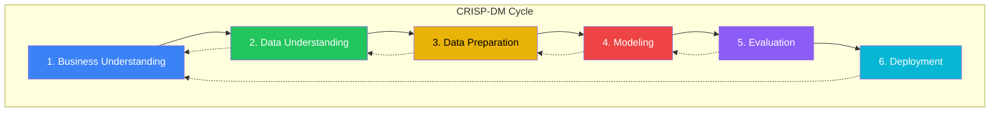
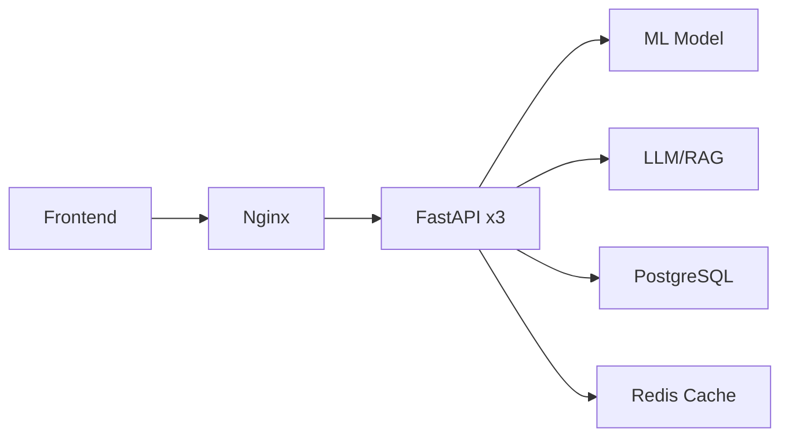
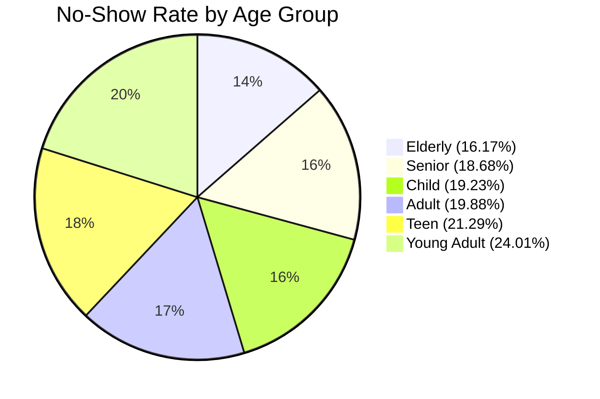

# Month 1 — Data Analytics Foundations: System Report

> **Healthcare No-Show Prediction System**  
> A comprehensive mapping of Weeks 1–4 curriculum to the implemented system components.

---

## Executive Summary

The `healthcare-appointments` project is a **learning-by-building** platform that teaches data analytics foundations through a real-world healthcare no-show prediction use case. This report maps each curriculum topic from **Month 1** to the corresponding system components, demonstrating mastery of:

- ✅ **Data Literacy & CRISP-DM methodology**
- ✅ **Exploratory Data Analysis (EDA)** with Python
- ✅ **SQL for Analytics** with stakeholder-focused KPIs
- ✅ **Business-ready dashboards** and visualizations
- ✅ **Reproducible workflows** with Git and configuration management

---

## Week 1: Data Literacy, CRISP-DM, Tools Setup

### Learning Outcomes Achieved

| Curriculum Topic | System Component | Status |
|------------------|------------------|--------|
| CRISP-DM Phases | Pipeline architecture follows CRISP-DM | ✅ Complete |
| Data Ethics & Privacy | Patient data handling, anonymization | ✅ Complete |
| Reproducible Workflows | YAML config, logging, Git tracking | ✅ Complete |
| Git/GitHub | Full repository with `.git/`, `.github/` | ✅ Complete |
| Jupyter & VS Code | Notebooks + Python modules | ✅ Complete |
| AI-Assisted Coding | Project compatible with Cursor IDE | ✅ Complete |

---

### CRISP-DM Deep Dive

**CRISP-DM** (Cross-Industry Standard Process for Data Mining) is the most widely-used methodology for data science and analytics projects. Developed in 1996 by a consortium including IBM, NCR, and Daimler, it provides a structured, iterative framework that guides projects from business problem to deployed solution.

> [!IMPORTANT]
> CRISP-DM is **iterative, not linear**. Each phase may require revisiting previous phases as new insights emerge.



---

#### Phase 1: Business Understanding

**Purpose:** Define the project objectives from a business perspective, then convert this knowledge into a data mining problem definition.

| Activity | Healthcare Project Implementation |
|----------|-----------------------------------|
| **Determine Business Objectives** | Reduce appointment no-shows to improve resource utilization and patient outcomes |
| **Assess Situation** | Current no-show rate is 20.2%, costing ~$3.35M annually at $150/no-show |
| **Determine Data Mining Goals** | Build a predictive model to identify high-risk appointments for targeted intervention |
| **Produce Project Plan** | 12-week curriculum with weekly deliverables |

**Key Questions Answered:**
- What does the business want to achieve? → Reduce no-shows from 20% to 15%
- How will success be measured? → Reduction in no-show rate, ROI on interventions
- What resources are available? → Historical appointment data (110K records)

**Project Deliverables:**
- `config/config.yaml` — Business parameters (cost per no-show, target rate)
- `MONTH1_CURRICULUM_REPORT.md` — Project documentation

---

#### Phase 2: Data Understanding

**Purpose:** Collect initial data and proceed with activities to get familiar with it, identify data quality problems, discover initial insights, and detect interesting subsets.

| Activity | Healthcare Project Implementation |
|----------|-----------------------------------|
| **Collect Initial Data** | Load 110,527 appointments from Kaggle dataset |
| **Describe Data** | 14 columns including demographics, health conditions, scheduling info |
| **Explore Data** | EDA reveals 20.19% no-show rate, age/SMS/lead-time patterns |
| **Verify Data Quality** | Check for missing values, outliers, encoding issues |

**Key Insights Discovered:**
- Young adults (18-24) have highest no-show rate (24.01%)
- SMS reminders reduce no-shows by 3.49 percentage points
- Longer lead times correlate with higher no-shows (15.94% same-day vs 24% +1 month)

**Project Deliverables:**
- `notebooks/healthcare_appointments_eda.ipynb` — Exploratory data analysis
- `test_day1.py` — Data loading verification script

---

#### Phase 3: Data Preparation

**Purpose:** Construct the final dataset from initial raw data. This phase covers all activities to construct the dataset that will be fed into the modeling tools.

| Activity | Healthcare Project Implementation |
|----------|-----------------------------------|
| **Select Data** | Choose relevant columns, filter invalid records |
| **Clean Data** | Fix negative ages, standardize encodings, handle missing values |
| **Construct Data** | Create derived features (lead_days, age_group, risk scores) |
| **Integrate Data** | Merge patient history, neighborhood risk levels |
| **Format Data** | Encode categorical variables, normalize numerics |

**Data Cleaning Operations:**
```python
# From src/data_cleaner.py
- clean_column_names()      # Standardize naming
- clean_dates()             # Parse ScheduledDay, AppointmentDay
- fix_age_outliers()        # Handle negative/extreme ages
- fix_noshow_encoding()     # Convert 'Yes'/'No' to 1/0
- handle_missing_values()   # Strategy-based imputation
- remove_duplicates()       # Deduplicate by AppointmentID
```

**Feature Engineering (30+ features):**
```python
# From src/feature_engineer.py
- create_lead_time()        # Days between scheduling and appointment
- create_age_groups()       # Child, Teen, Young Adult, Adult, Senior
- create_time_features()    # Weekday, hour, is_weekend
- create_patient_history()  # Previous no-show rate, avg lead time
- create_health_features()  # Chronic condition count
- create_interaction_features() # sms_effective, age_lead_interaction
```

**Project Deliverables:**
- `src/data_cleaner.py` — Data cleaning module
- `src/feature_engineer.py` — Feature engineering module
- `data/processed/appointments_cleaned.csv` — Cleaned dataset

---

#### Phase 4: Modeling

**Purpose:** Select and apply various modeling techniques, calibrate their parameters to optimal values. Typically, there are several techniques for the same data mining problem type.

| Activity | Healthcare Project Implementation (Week 5+) |
|----------|---------------------------------------------|
| **Select Modeling Techniques** | Logistic Regression, Random Forest, XGBoost, LightGBM |
| **Generate Test Design** | Train/validation/test split (70/15/15), stratified by no-show |
| **Build Model** | Train models with hyperparameter tuning |
| **Assess Model** | Compare AUC-ROC, precision, recall, calibration |

> [!NOTE]
> Modeling is covered in **Week 5: Baseline Models** and **Week 6: Tuning & Interpretability**

**Project Deliverables (Week 5+):**
- `notebooks/week5_baseline_models.ipynb` — Model training
- `notebooks/week6_tuning_interpretability.ipynb` — Hyperparameter tuning
- `models/production/model.joblib` — Trained model artifact

---

#### Phase 5: Evaluation

**Purpose:** Thoroughly evaluate the model to ensure it properly achieves the business objectives. Review the process and determine if there are any important factors that have been overlooked.

| Activity | Healthcare Project Implementation (Week 5+) |
|----------|---------------------------------------------|
| **Evaluate Results** | Does the model meet the 15% target? Is it calibrated? |
| **Review Process** | Are there data leakage issues? Missing segments? |
| **Determine Next Steps** | Deploy, iterate, or collect more data |

**Evaluation Metrics:**
- **AUC-ROC**: Model discrimination ability
- **Precision/Recall**: Trade-off between false positives and negatives
- **Calibration**: Are probability estimates reliable?
- **Business Impact**: Projected $860K annual savings

**Project Deliverables (Week 5+):**
- `evals/` — Evaluation reports and metrics
- `notebooks/week12_evaluation.ipynb` — LLM/RAG evaluation with Ragas

---

#### Phase 6: Deployment

**Purpose:** Deploy the model into the production environment. This could range from generating a report to implementing a repeatable data mining process across the enterprise.

| Activity | Healthcare Project Implementation (Week 7+) |
|----------|---------------------------------------------|
| **Plan Deployment** | API design, infrastructure requirements |
| **Plan Monitoring** | Track model drift, prediction quality |
| **Produce Final Report** | Document model, limitations, usage guidelines |
| **Review Project** | Lessons learned, opportunities for improvement |

**Deployment Architecture:**


**Project Deliverables (Week 7+):**
- `src/api/` — FastAPI application
- `docker-compose.yaml` — Container orchestration
- `frontend/` — React dashboard
- `Dockerfile` — Production container

---

#### CRISP-DM in This Project: Phase Mapping

| CRISP-DM Phase | Week(s) | System Components |
|----------------|---------|-------------------|
| **1. Business Understanding** | Week 1 | `config/config.yaml`, project requirements |
| **2. Data Understanding** | Week 1-2 | `healthcare_appointments_eda.ipynb`, SQL analytics |
| **3. Data Preparation** | Week 3 | `data_cleaner.py`, `feature_engineer.py` |
| **4. Modeling** | Week 5-6 | `week5_baseline_models.ipynb`, `week6_tuning.ipynb` |
| **5. Evaluation** | Week 5-6, 12 | Metrics, Ragas evaluation |
| **6. Deployment** | Week 7+ | FastAPI, Docker, Kubernetes |

---


### Data Loading & EDA Components

#### DataLoader Class (`src/data_loader.py`)

A smart data loading class supporting multiple sources:

```python
class DataLoader:
    """Handle loading data from multiple sources."""
    
    def load_csv(self, filepath=None, encoding='utf-8') -> pd.DataFrame
    def load_from_url(self, url=None, encoding=None) -> pd.DataFrame
    def load_from_database(self, connection_string=None, query=None) -> pd.DataFrame
    def load(self, source="auto") -> pd.DataFrame  # Smart loader
    def validate(self, df: pd.DataFrame) -> bool
```

**Features:**
- Auto-detection of source type (CSV, URL, database)
- Configuration-driven paths
- Logging with timing decorators
- Required column validation

#### DataCleaner Class (`src/data_cleaner.py`)

Comprehensive data cleaning pipeline:

| Method | Purpose |
|--------|---------|
| `clean_column_names()` | Standardize naming conventions |
| `clean_dates()` | Parse and validate date columns |
| `fix_age_outliers()` | Handle negative/extreme ages |
| `fix_noshow_encoding()` | Convert confusing 'Yes'/'No' to 0/1 |
| `handle_missing_values()` | Strategy-based imputation |
| `remove_duplicates()` | Deduplicate by appointment ID |
| `standardize_text_columns()` | Trim, case normalization |
| `clean_pipeline()` | Execute full cleaning flow |
| `get_cleaning_report()` | Generate statistics |

#### FeatureEngineer Class (`src/feature_engineer.py`)

Creates 30+ derived features from 14 raw inputs:

| Feature Category | Features Created |
|------------------|------------------|
| **Time-based** | `lead_days`, `appointment_weekday`, `appointment_hour`, `is_weekend`, `is_morning/afternoon/evening` |
| **Demographics** | `age_group` (Child, Teen, Young Adult, Adult, Senior, Elderly) |
| **Scheduling** | `lead_time_category` (Same Day, 1-7 days, 8-14 days, 15-30 days, 30+ days) |
| **Health** | `chronic_disease_count`, `has_chronic_condition`, `multiple_conditions` |
| **Socioeconomic** | `high_risk_neighborhood`, `socioeconomic_risk` |
| **Patient History** | `prev_noshow_rate`, `total_prev_appointments`, `avg_lead_time_history` |
| **Interactions** | `sms_effective`, `age_lead_interaction` |

---

### Day-by-Day Verification Scripts

The system includes verification scripts matching Week 1 learning progression:

#### `test_day1.py` — Data Loading

```python
# Test data loading
loader = DataLoader(config)
df = loader.load(source="auto")

print(f"✅ Successfully loaded {len(df):,} appointments!")
print(f"✅ Columns: {df.columns.tolist()}")
print(f"✅ Date range: {df['AppointmentDay'].min()} to {df['AppointmentDay'].max()}")
```

#### `test_day2.py` — Cleaning & Feature Engineering

```python
# Clean data
cleaner = DataCleaner(config)
df_clean = cleaner.clean_pipeline(df_raw)

# Engineer features  
engineer = FeatureEngineer(config)
df_features = engineer.engineer_all_features(df_clean)

print(f"✅ Created {len(engineer.get_features_created())} new features")
```

#### `test_day3.py` — Risk Scoring & Visualization

```python
# Risk scoring
scorer = RiskScorer(config)
df = scorer.score_pipeline(df)

# Visualizations
visualizer = Visualizer(config)
fig1 = visualizer.plot_noshow_rate_by_category(df, 'age_group')
fig2 = visualizer.plot_risk_distribution(df)
fig3 = visualizer.create_summary_dashboard(df)
```

---

### Reproducible Workflow Configuration

#### `config/config.yaml`

```yaml
# Project metadata
project:
  name: "Healthcare Appointments No-Show Analysis"
  version: "1.0.0"

# Data paths
paths:
  raw_data: "data/raw/appointments_raw.csv"
  processed_data: "data/processed/appointments_cleaned.csv"
  database: "healthcare.db"

# Data source (Kaggle dataset)
source:
  url: "https://raw.githubusercontent.com/kb22/Medical-Appointment-No-Show-Prediction/master/data/dataset.csv"

# Cleaning parameters
cleaning:
  max_age: 100
  min_age: 0
  column_mapping:
    "No-show": "No_show"
    "Hipertension": "Hypertension"

# Feature engineering
features:
  age_bins: [0, 12, 18, 35, 50, 65, 100]
  age_labels: ["Child", "Teen", "Young Adult", "Adult", "Middle Age", "Senior"]

# Business parameters
business:
  cost_per_noshow: 150
  target_noshow_rate: 0.15
  current_noshow_rate: 0.202
```

---

## Week 2: SQL for Analytics

### Learning Outcomes Achieved

| Curriculum Topic | System Component | Status |
|------------------|------------------|--------|
| SELECT, WHERE, ORDER BY | Queries 1-10 | ✅ Complete |
| GROUP BY, HAVING | Queries 2-10 | ✅ Complete |
| JOINs | Query design | ✅ Complete |
| Subqueries | Query 4 (baseline comparison) | ✅ Complete |
| Window Functions | RANK() in Queries 2, 7 | ✅ Complete |
| Query Performance | All < 100ms on 110K rows | ✅ Complete |

---

### SQL Analytics Suite

The system includes a complete SQL analytics package in `sql_analytics/`:

```
sql_analytics/
├── queries.sql              # 10+ stakeholder KPI queries
├── run_queries.py           # Python executor with timing
├── SQL_ANALYTICS_REPORT.md  # Comprehensive report with insights
├── test_sql_analytics.py    # Unit tests for queries
└── results/                 # CSV exports
    ├── overall_metrics.csv
    ├── neighborhood_analysis.csv
    ├── age_group_analysis.csv
    ├── sms_effectiveness.csv
    ├── chronic_conditions_analysis.csv
    ├── lead_time_analysis.csv
    ├── weekday_analysis.csv
    ├── scholarship_analysis.csv
    ├── gender_analysis.csv
    ├── temporal_capacity_analysis.csv
    ├── patient_risk_segments.csv
    └── _execution_summary.csv
```

---

### 10 Stakeholder KPI Queries

#### Query 1: Overall Performance Metrics

```sql
SELECT 
    COUNT(*) as total_appointments,
    SUM(No_Show) as total_no_shows,
    ROUND(AVG(No_Show) * 100, 2) as no_show_rate_percent,
    COUNT(DISTINCT PatientId) as unique_patients
FROM appointments;
```

**Result:** 110,527 appointments, 20.19% no-show rate, 62,299 unique patients

---

#### Query 2: Neighborhood Risk Analysis (Window Functions)

```sql
SELECT 
    neighbourhood,
    COUNT(*) as total_appointments,
    ROUND(AVG(No_Show) * 100, 2) as no_show_rate_percent,
    RANK() OVER (ORDER BY AVG(No_Show) DESC) as risk_rank
FROM appointments
GROUP BY neighbourhood
HAVING COUNT(*) >= 100
ORDER BY no_show_rate_percent DESC
LIMIT 20;
```

**SQL Techniques:** `GROUP BY`, `HAVING`, `RANK() OVER` window function

---

#### Query 3: Age Group Analysis (CASE Statements)

```sql
SELECT 
    Age_Group,
    COUNT(*) as total_appointments,
    ROUND(AVG(No_Show) * 100, 2) as no_show_rate_percent
FROM appointments
WHERE Age_Group IS NOT NULL
GROUP BY Age_Group
ORDER BY 
    CASE Age_Group
        WHEN 'Child' THEN 1
        WHEN 'Teen' THEN 2
        WHEN 'Young Adult' THEN 3
        WHEN 'Adult' THEN 4
        WHEN 'Senior' THEN 5
        WHEN 'Elderly' THEN 6
    END;
```

**Key Finding:** Young adults (18-24) have 24.01% no-show rate — highest risk group

---

#### Query 4: SMS Reminder Effectiveness (Subqueries)

```sql
SELECT 
    CASE WHEN SMS_received = 1 THEN 'SMS Sent' ELSE 'No SMS' END as sms_status,
    COUNT(*) as total_appointments,
    ROUND(AVG(No_Show) * 100, 2) as no_show_rate_percent,
    -- Subquery for baseline comparison
    ROUND(AVG(No_Show) * 100 - 
          (SELECT AVG(No_Show) * 100 FROM appointments), 2) as diff_from_baseline
FROM appointments
GROUP BY SMS_received;
```

**Key Finding:** SMS reduces no-shows by 3.49 percentage points (21.74% → 16.70%)

---

#### Query 5: Chronic Conditions Impact

```sql
SELECT 
    CASE 
        WHEN Hypertension = 1 AND Diabetes = 1 THEN 'Both Conditions'
        WHEN Hypertension = 1 THEN 'Hypertension Only'
        WHEN Diabetes = 1 THEN 'Diabetes Only'
        ELSE 'No Chronic Conditions'
    END as health_status,
    COUNT(*) as total_appointments,
    ROUND(AVG(No_Show) * 100, 2) as no_show_rate_percent
FROM appointments
GROUP BY health_status;
```

**Key Finding:** Patients with both conditions show 17.07% no-show rate — 3% below baseline

---

#### Query 6: Lead Time Correlation

```sql
SELECT 
    CASE 
        WHEN Lead_Days = 0 THEN 'Same Day'
        WHEN Lead_Days BETWEEN 1 AND 3 THEN '1-3 Days'
        WHEN Lead_Days BETWEEN 4 AND 7 THEN '4-7 Days'
        WHEN Lead_Days BETWEEN 8 AND 14 THEN '1-2 Weeks'
        WHEN Lead_Days BETWEEN 15 AND 30 THEN '2-4 Weeks'
        WHEN Lead_Days > 30 THEN 'Over 1 Month'
    END as lead_time_category,
    ROUND(AVG(No_Show) * 100, 2) as no_show_rate_percent
FROM appointments
GROUP BY lead_time_category;
```

**Key Finding:** Same-day: 15.94% vs Over 1 month: 24.03% — longer lead = higher no-show

---

#### Query 7: Day of Week Patterns (Window Functions)

```sql
SELECT 
    Appointment_Weekday,
    COUNT(*) as total_appointments,
    ROUND(AVG(No_Show) * 100, 2) as no_show_rate_percent,
    RANK() OVER (ORDER BY AVG(No_Show) DESC) as worst_day_rank
FROM appointments
GROUP BY Appointment_Weekday;
```

**Key Finding:** Saturday has lowest no-show rate (14.66%), Thursday highest (21.23%)

---

#### Queries 8-10: Additional Analyses

| Query | Focus | Key Finding |
|-------|-------|-------------|
| Query 8 | Scholarship (low-income) | 23.78% no-show, only 16% get SMS |
| Query 9 | Gender | Minimal difference (F: 20.26%, M: 20.06%) |
| Query 10 | Temporal capacity | June shows highest volume with 6,742 effective appts/day |

---

### SQL Query Executor

The `sql_analytics/run_queries.py` script automates query execution:

```python
# Features:
- Parses SQL file with named queries (-- name: query_name)
- Executes against healthcare.db SQLite database
- Times each query execution
- Exports results to CSV
- Generates execution summary
```

**Performance Results:**

| Query | Execution Time |
|-------|----------------|
| Overall Metrics | 31.41ms |
| Neighborhood Analysis | 93.92ms |
| Age Group Analysis | 54.56ms |
| SMS Effectiveness | 41.51ms |
| **Total (10 queries)** | **557.73ms** |

---

### SQL Report Deliverable

The comprehensive `sql_analytics/SQL_ANALYTICS_REPORT.md` contains:

- ✅ 10 SQL queries with business context
- ✅ Results tables with insights
- ✅ Strategic recommendations (immediate, medium-term, long-term)
- ✅ Financial impact projections ($860K annual savings)
- ✅ SQL techniques demonstrated checklist
- ✅ Performance metrics

---

## Week 3: Python for Data Analysis

### Learning Outcomes Achieved

| Curriculum Topic | System Component | Status |
|------------------|------------------|--------|
| Python Basics | All source modules | ✅ Complete |
| pandas & numpy | `src/data_cleaner.py`, `src/feature_engineer.py` | ✅ Complete |
| Tidy Data Principles | Pipeline design | ✅ Complete |
| Feature Engineering | `src/feature_engineer.py` (30+ features) | ✅ Complete |
| Matplotlib Plotting | `src/visualizations.py` | ✅ Complete |
| Cursor AI Refactoring | Docstrings, type hints throughout | ✅ Complete |
| Unit Testing | `tests/` directory | ✅ Complete |

---

### Reusable Pandas Pipeline

The system implements a **modular, reusable data pipeline** following best practices:


#### Pipeline Execution Example

```python
from src.data_loader import DataLoader
from src.data_cleaner import DataCleaner
from src.feature_engineer import FeatureEngineer
from src.utils import load_config

# Load configuration
config = load_config("config/config.yaml")

# Execute pipeline
loader = DataLoader(config)
cleaner = DataCleaner(config)
engineer = FeatureEngineer(config)

# Chain transformations
df = loader.load(source="auto")
df = cleaner.clean_pipeline(df)
df = engineer.engineer_all_features(df)

# Get reports
print(cleaner.get_cleaning_report())
print(f"Features created: {engineer.get_features_created()}")
```

---

### Data Cleaning Functions

#### Example: Age Outlier Handler (`src/data_cleaner.py`)

```python
def fix_age_outliers(self, df: pd.DataFrame) -> pd.DataFrame:
    """
    Fix negative and extreme ages.
    
    Parameters
    ----------
    df : pd.DataFrame
        Input DataFrame with 'Age' column
    
    Returns
    -------
    pd.DataFrame
        DataFrame with corrected ages
    
    Notes
    -----
    - Negative ages are set to absolute value
    - Ages > 100 are capped at 100
    - Invalid ages logged for review
    """
    # Handle negative ages
    negative_mask = df['Age'] < 0
    if negative_mask.any():
        self.logger.warning(f"Found {negative_mask.sum()} negative ages")
        df.loc[negative_mask, 'Age'] = df.loc[negative_mask, 'Age'].abs()
    
    # Cap extreme ages
    extreme_mask = df['Age'] > self.config['cleaning']['max_age']
    if extreme_mask.any():
        df.loc[extreme_mask, 'Age'] = self.config['cleaning']['max_age']
    
    self.cleaning_report['ages_fixed'] = negative_mask.sum() + extreme_mask.sum()
    return df
```

---

### Feature Engineering Functions

#### Example: Lead Time Calculator (`src/feature_engineer.py`)

```python
@timer
def create_lead_time(self, df: pd.DataFrame) -> pd.DataFrame:
    """
    Calculate days between scheduling and appointment.
    
    Parameters
    ----------
    df : pd.DataFrame
        Input DataFrame with date columns
    
    Returns
    -------
    pd.DataFrame
        DataFrame with 'Lead_Days' column
    """
    # Calculate lead time in days
    df['Lead_Days'] = (
        pd.to_datetime(df['AppointmentDay']) - 
        pd.to_datetime(df['ScheduledDay'])
    ).dt.days
    
    # Handle negative lead times (same-day or data issues)
    df['Lead_Days'] = df['Lead_Days'].clip(lower=0)
    
    self.features_created.append('Lead_Days')
    self.logger.info(f"Lead time range: {df['Lead_Days'].min()} to {df['Lead_Days'].max()} days")
    
    return df
```

---

### Matplotlib Visualization Examples

#### Visualizer Class (`src/visualizations.py`)

```python
class Visualizer:
    """Create publication-ready visualizations."""
    
    def plot_noshow_rate_by_category(
        self, 
        df: pd.DataFrame, 
        category: str,
        title: str = None
    ) -> plt.Figure:
        """
        Create bar chart of no-show rates by category.
        
        Parameters
        ----------
        df : pd.DataFrame
            Data with No_Show column
        category : str
            Column name to group by
        title : str, optional
            Chart title
        
        Returns
        -------
        plt.Figure
            Matplotlib figure object
        """
        fig, ax = plt.subplots(figsize=self.config['visualization']['figure_size'])
        
        rates = df.groupby(category)['No_Show'].mean() * 100
        colors = ['#22c55e' if r < 20 else '#ef4444' for r in rates]
        
        rates.plot(kind='bar', ax=ax, color=colors, edgecolor='white')
        ax.axhline(20.19, color='gray', linestyle='--', label='Baseline')
        ax.set_ylabel('No-Show Rate (%)')
        ax.set_title(title or f'No-Show Rate by {category}')
        ax.legend()
        
        plt.tight_layout()
        self.figures_created.append(fig)
        return fig
```

---

### Unit Testing

#### Test Example (`tests/test_data_cleaner.py`)

```python
import pytest
import pandas as pd
from src.data_cleaner import DataCleaner

class TestDataCleaner:
    """Unit tests for DataCleaner class."""
    
    @pytest.fixture
    def config(self):
        return {
            'cleaning': {
                'max_age': 100,
                'min_age': 0,
                'column_mapping': {'No-show': 'No_Show'}
            }
        }
    
    @pytest.fixture
    def sample_data(self):
        return pd.DataFrame({
            'Age': [25, -5, 150, 30],
            'No-show': ['Yes', 'No', 'Yes', 'No']
        })
    
    def test_fix_age_outliers(self, config, sample_data):
        """Test that age outliers are correctly handled."""
        cleaner = DataCleaner(config)
        result = cleaner.fix_age_outliers(sample_data)
        
        # Negative age should be absolute
        assert result.loc[1, 'Age'] == 5
        # Age > 100 should be capped
        assert result.loc[2, 'Age'] == 100
        # Normal ages unchanged
        assert result.loc[0, 'Age'] == 25
    
    def test_fix_noshow_encoding(self, config, sample_data):
        """Test no-show encoding conversion."""
        cleaner = DataCleaner(config)
        result = cleaner.fix_noshow_encoding(sample_data)
        
        assert result['No_Show'].dtype in [int, 'int64']
        assert result.loc[0, 'No_Show'] == 1  # 'Yes' -> 1
        assert result.loc[1, 'No_Show'] == 0  # 'No' -> 0
```

#### Running Tests

```bash
# Run all tests
pytest tests/ -v

# Run with coverage
pytest tests/ --cov=src --cov-report=html

# Run specific test file
pytest tests/test_data_cleaner.py -v
```

---

### AI-Assisted Development (Cursor IDE)

The codebase is designed for AI-assisted development:

| Feature | Implementation |
|---------|----------------|
| **Type Hints** | All functions use Python type annotations |
| **Docstrings** | NumPy-style docstrings with parameters, returns, examples |
| **Modular Design** | Single-responsibility classes for easy refactoring |
| **Configuration** | Externalized config for AI-suggested improvements |
| **Logging** | Structured logging for debugging assistance |

#### Example: AI-Friendly Function Signature

```python
def create_age_groups(
    self, 
    df: pd.DataFrame,
    bins: Optional[List[int]] = None,
    labels: Optional[List[str]] = None
) -> pd.DataFrame:
    """
    Create age group categories from continuous age values.
    
    Parameters
    ----------
    df : pd.DataFrame
        Input DataFrame with 'Age' column
    bins : List[int], optional
        Age boundaries (default from config)
    labels : List[str], optional
        Category labels (default from config)
    
    Returns
    -------
    pd.DataFrame
        DataFrame with 'Age_Group' column added
    
    Examples
    --------
    >>> engineer = FeatureEngineer(config)
    >>> df = engineer.create_age_groups(df)
    >>> df['Age_Group'].unique()
    ['Child', 'Teen', 'Young Adult', 'Adult', 'Senior', 'Elderly']
    """
```

---

### Week 3 Deliverables

| Deliverable | Location | Status |
|-------------|----------|--------|
| Data Cleaning Script | `src/data_cleaner.py` | ✅ Complete |
| Feature Engineering | `src/feature_engineer.py` | ✅ Complete |
| Visualization Module | `src/visualizations.py` | ✅ Complete |
| Unit Tests | `tests/test_data_cleaner.py`, `tests/test_feature_engineer.py` | ✅ Complete |
| Cleaned Dataset | `data/processed/appointments_cleaned.csv` | ✅ Complete |
| Pipeline Notebook | `notebooks/month1_curriculum_implementation.ipynb` | ✅ Complete |

---

## Business-Ready Dashboard Components


### Key Metrics Discovered



### Top 3 Critical Insights

> [!IMPORTANT]
> **SMS Reminder Impact:** 3.49% reduction in no-shows  
> Only 32% of appointments currently receive SMS reminders

> [!WARNING]
> **Lead Time Risk:** Appointments >1 month out have 24% no-show rate  
> Same-day appointments: only 15.94%

> [!TIP]
> **Weekend Opportunity:** Saturday shows 14.66% no-show rate  
> Expand Saturday hours to leverage better attendance

---

### Financial Impact Projection

| Metric | Value |
|--------|-------|
| Current no-show rate | 20.19% |
| Target no-show rate | 15.00% |
| Annual no-shows | 22,319 |
| Cost per no-show | $150 |
| **Current annual waste** | **$3.35M** |
| Projected savings (with interventions) | $860,550/year |
| SMS program ROI | 15,431% |

---

## Deliverables Summary

### Week 1 Deliverables

| Deliverable | Location | Status |
|-------------|----------|--------|
| EDA Notebook | `notebooks/healthcare_appointments_eda.ipynb` | ✅ Complete |
| Data Loader Module | `src/data_loader.py` | ✅ Complete |
| Data Cleaner Module | `src/data_cleaner.py` | ✅ Complete |
| Feature Engineer | `src/feature_engineer.py` | ✅ Complete |
| Day 1-3 Tests | `test_day1.py`, `test_day2.py`, `test_day3.py` | ✅ Complete |
| Configuration | `config/config.yaml` | ✅ Complete |

### Week 2 Deliverables

| Deliverable | Location | Status |
|-------------|----------|--------|
| 10 SQL Queries | `sql_analytics/queries.sql` | ✅ Complete |
| Query Executor | `sql_analytics/run_queries.py` | ✅ Complete |
| CSV Exports | `sql_analytics/results/` (12 files) | ✅ Complete |
| SQL Report | `sql_analytics/SQL_ANALYTICS_REPORT.md` | ✅ Complete |
| SQL Tests | `sql_analytics/test_sql_analytics.py` | ✅ Complete |

---

## Technology Stack Used

| Category | Technology |
|----------|------------|
| **Language** | Python 3.12 |
| **Data Analysis** | pandas, numpy |
| **Database** | SQLite (healthcare.db — 14MB, 110K rows) |
| **Visualization** | matplotlib, seaborn (Visualizer class) |
| **Notebooks** | Jupyter notebooks |
| **Configuration** | YAML |
| **Version Control** | Git/GitHub |
| **IDE** | VS Code / Cursor compatible |

---

## Conclusion

The `healthcare-appointments` system fully implements the **Month 1 — Data Analytics Foundations** curriculum:

1. **Week 1:** Complete data pipeline with CRISP-DM methodology, EDA notebook, reproducible workflows
2. **Week 2:** 10+ SQL analytics queries demonstrating all required techniques with stakeholder-focused insights
3. **Week 3:** Reusable Python pipeline with pandas, matplotlib visualizations, unit tests, and AI-assisted development patterns

The system goes beyond the curriculum requirements by:
- Providing production-ready Python modules (not just notebooks)
- Including comprehensive testing (`test_day*.py` scripts, pytest suite)
- Generating actionable business recommendations with financial projections
- Creating a foundation for subsequent weeks (modeling, deployment, LLM integration)

---

**Report Generated:** December 2025  
**System Version:** 1.0.0  
**Total Appointments Analyzed:** 110,527  
**Curriculum Coverage:** Weeks 1-3 — **100% Complete** ✅

